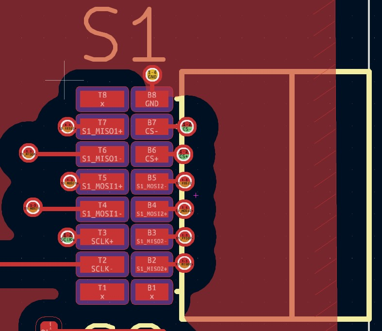

# Adapter

*Fig. 1. Adapter connections.*

*The Iris 128B system consists of 2 boards: the headstage and the adapter.*

* The adapter board receives signals from the headstage (through the 80 pin nanopitch Molex connector and cable) and breaks them out into cables that interface with the Intan Rec/Stim Controller.

This is a board with no active components on it. It's purpose is simply to route the connections from the Iris-128B headstage to the power supply, and the four ports on the Intan RHS controller. It also has some header pins intended for testing the SPI connections.

---

### Specifications

This is a 4 layer board that only routes digital signals. It takes the signals from the headstages and breaks them out into the appropriate connector for the RHS intan controller (interfacing with PZN 18 pin omnetics cables).

*Fig. 2. Omnetics output from adapter board. This is repeated 4 times. Each connector routes two chips into the ports on each controller.*

#### Table 1. PCB Specifications

| PCB Specification               | Value           |
| ------------------------------- | --------------- |
| Size                            | 27 × 44 mm² |
| Trace Width / Space             | 3 mil / 3 mil   |
| Layers                          | 8               |
| Thru-Hole Via (Hole / Diameter) | 8 mil / 14 mil  |
| Microvia (Hole / Diameter)      | 6 mil / 12 mil  |
| Thickness                       | 0.039 in (1 mm) |
| Surface Finish                  | ENIG            |
| Copper Weight                   | 1 oz            |

#### Table 2. Adapter components

| Component | Part                                         | Manufacturer | Description       |
| --------- | -------------------------------------------- | ------------ | ----------------- |
| J1        | SEAM8-20-S02.0-S-08-3                        | Samtec       | 160-pin connector to electrode sites. |
| S1-S4     | Omnetics A79633 PZN-16-AA| Intan             | Intan        |Connector for RHS2000 interface (chip side) to the Intan controller |  
| VSTIM-, VSTIM+, VCC      | CP-063AH-ND  Pwr Jack| Molex        | Barrel jack inputs for the power supplies. |