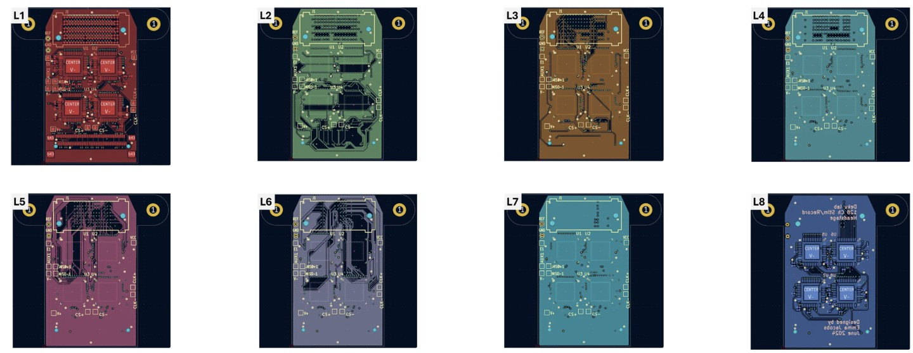

# Headstage

*Fig. 1. Schematic of Iris 128B.*

*The Iris 128B system consists of 2 boards: the headstage and the adapter.*

* The headstage is a small electronic system placed on top of or near the electrophysiological signals being recorded.
* It uses commercially available off-the-shelf components.

### Fabrication Notes

The cable used to connect the headstage to the adapter board is Molex 8X STR NPIO/ 8X STR NPIO 2PC LATCH 34A, #205058-1002. This cable is no longer manufactured. However, the connector is still available. We are working on alternatives - and a smaller version of these headstages. Feel free to contact us (fdeku@uoregon.edu or manuel@openic.org) if you would like to use this design and want to discuss alternative options. 

If you are able to use the Molex nanopitch cables, please note:

* In this design, pins *Chip 5 – MOSI+* and *Chip 5 – MOSI–* connect to unused pins on the cable (A20 and A21). To address this we modified the cable by adding wires to it after it was ordered.

#### Headstage Cost Breakdown

- 8 × $392 — RHS2116 chips  
- 1 × $24 — SEAM8-20-S02.0-S-08-3 connector  
- 1 × $67 — NPIO / 8X STR NPIO 2PC LATCH 34A cable **_(DISCONTINUED AS OF AUG. 2025)_**  
- 1 × $11 — CONN NANO-PITCH I/O RCPT 80P RA connector  
- $125 — 1 headstage printed circuit board  
- $60 — 1 adapter printed circuit board  
- 4 × $265 — RHS interface cables  

----

#### **Estimated Total Costs**
- **≈ $3,356** — Headstage  
- **≈ $1,325** — Cabling

### Components

| Component | Part                                         | Manufacturer | Description       |
| --------- | -------------------------------------------- | ------------ | ----------------- |
| J1        | SEAM8-20-S02.0-S-08-3                        | Samtec       | 160-pin connector to electrode sites. |
| U1–U8     | RHS2116                                      | Intan        | Stimulation & recording chip.  |
| J2        | CONN NANO-PITCH I/O RCPT 80P RA, #1731620131 | Molex        | 80-pin connector that routes the digital signals from the headstage to the adapter board.  |

## Specifications

### Electrode128

*This is the output/input that interfaces with the electrophysiological signals.*

We are currently using the SEAM8 Samtec connector for interfacing with a 128-ch electrode array.
The footprint on the headstage is shown below.

The left and right two rows are dedicated for GND and REF connectors.
The remaining 16×8 are for connecting to the 128 electrodes. All the GND for the chips, power supplies, and thin-film are shared.

This is the same footprint/connector used with BlackRock Cereplex E headstages, maintaining compatibility with interchangeable thin-film interfaces.

*Fig. 2. Footprint of SEAM 160 (8x20) pin connector. Outer two rows are reserved for reference and gnd. The 3.3V and LED are unconnected. The locations of these gnd and reference pins are meant to match the Cereplex E headstages. We have used thin-films interchangeably between the two systems so we have preserved that footprint in this version of the headstage. The footprint is labeled C#, indicating the chip it routes to, and E# indicating the electrode.*

### Chip1 through Chip8

These are RHS2116 chips (QFN package) from Intan Technologies.
There are 8 total chips (16 electrodes each) communicating with the controller via SPI (Serial Peripheral Interface). 

*Fig. 3. Footprint of RHS2116 on Iris128B with broadly labeled pins. See the Intan RHS2116 datasheet for specific details. *

The reference and ground pins can be shorted or disconnected using the pads shown below.

*Fig. 4. Footprint location of pads to short ref and gnd. Also seen here are the plated through holes on the left where gnd and ref wires can be soldered.*

Digital (SPI) communication lines to each of the 8 chips:

* Chip Select (CS)
* Serial Clock (SCLK)
* Serial Data Input (MOSI)
* Serial Data Output (MISO)

Because **LVDS (Low-Voltage Differential Signaling)** is used to decrease noise sensitivity, each line type has a + and – pair:

* CS+, CS–
* SCLK+, SCLK–
* MOSI+, MOSI–
* MISO+, MISO–

LVDS transmits low-voltage paired differential signals, reducing electromagnetic interference (EMI).

**Power requirements:**

* ±3.3V to ±7V for stimulation
* 3.3V for digital logic and analog power
* ~50 mW consumption (RHS2116, 16 channels recording)

For comparison:

* **RHD2164**: 3.3V single supply, no stimulation, ~75 mW for 64 channels.

*Fig. 5. Footprint of Molex 80 pin connector on Iris128B with broadly labeled pins. Any unlabled pins are digital communication lines to the chips. Not the x for NC pins due to the commericially available cable assembly.*

SPI lines are routed through the adapter board to the Intan RHS controller ports A–D.
SCLK and CS lines are shared between all chips, while data input/output lines are individually connected.

### Layers

#### Table 1. PCB Specifications

| PCB Specification               | Value           |
| ------------------------------- | --------------- |
| Size                            | 27 × 44 mm² |
| Trace Width / Space             | 3 mil / 3 mil   |
| Layers                          | 8               |
| Thru-Hole Via (Hole / Diameter) | 8 mil / 14 mil  |
| Microvia (Hole / Diameter)      | 6 mil / 12 mil  |
| Thickness                       | 0.039 in (1 mm) |
| Surface Finish                  | ENIG            |
| Copper Weight                   | 1 oz            |

#### Table 5. Headstage PCB Stack Up

| Layer | Notes                                                      |
| ----- | ---------------------------------------------------------- |
| 1     | Minimal local routing + GND plane                          |
|       | *Prepreg*                                                  |
| 2     | Supplies + SPI + some electrode signal routing + GND plane |
|       | *Core*                                                     |
| 3     | GND plane                                                  |
|       | *Prepreg*                                                  |
| 4     | Signal routing + some supply traces + GND plane            |
|       | *Core*                                                     |
| 5     | Signal routing + GND plane                                 |
|       | *Prepreg*                                                  |
| 6     | Signal routing + GND plane                                 |
|       | *Core*                                                     |
| 7     | GND plane + SPI routing                                    |
|       | *Prepreg*                                                  |
| 8     | Minimal local routing + GND plane                          |

