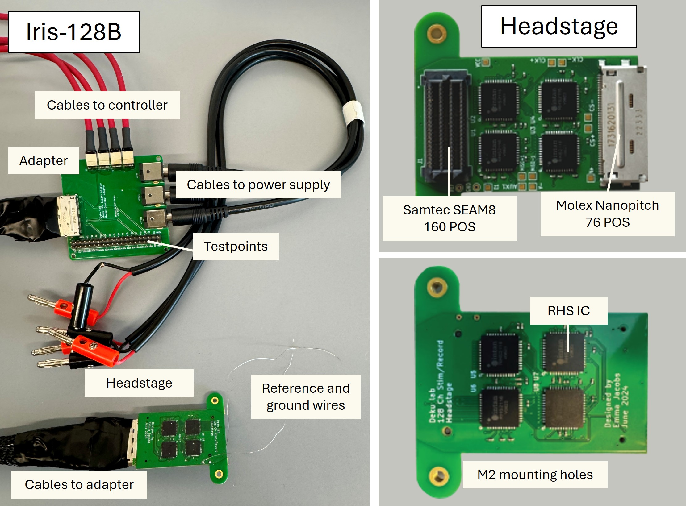

# Iris-128B

*Fig. 1. Iris-128B Neural Interface.*

The left labels the cables and components needed for the system, in addition to the Intan RHS controller and electrodes. Fig. 1 shows the front of Iris 128B with a SEARAY 160 pin connector, four RHS2000 ICs, an 80-pin Molex connector, pinouts, decoupling capacitors, and terminating resistors. Mounting holes are M2. The back of Iris 128B with four RHS2000 ICs.

## Description

### Components

The descriptions of each part of the system can be found below, along with a quick start guide.

| Component | Page |
| :-----: | :----- |
| Headstage | [Headstage](./headstage_iris128B.md) |
| Adapter | [Adapter](./adapter_iris128B.md) |
| Quick start guide | [Quick start guide](./quickstart_iris128B.md) |

### Overview

A 128-channel neural interface capable of stimulation and recording.

This project develops a system that can stimulate and record from 128 channels using commercially available ICs and integrates into existing commercially available controllers (Intan RHS system). This can be used for small animal, anesthetized electrophysiology, non-human primates, or could be applied to clinical, intraoperative human use cases.

### Iris 128B Architecture

*The Iris 128B system consists of 2 boards: the headstage and the adapter.*

* The headstage is a small electronic system placed on top of or near the electrophysiological signals being recorded.
* It uses commercially available off-the-shelf components.
* The adapter board receives signals from the headstage (through the 80 pin nanopitch Molex connector and cable) and breaks them out into cables that interface with the **Intan Rec/Stim Controller**.

*Fig. 2. System architecture.*

 

## Specifications

* Recording and stimulation from all 128 channels.
* Compatible with Intan Recording Controller and Intan Stim/Record Controller.
* *SEAM8 Samtec* connector for interfacing with 128-ch electrode array and compatible with *BlackRock Cereplex E headstages*.
* The *headstage* has a size of 27 x 44 mm$^2$.
* *Molex Nanopitch 76-POS* connector to interface with *Adapter* board through a single cable.
* *Adapter* board draws power from power supply.
* The *adapter* has a size of 57 x 58 mm$^2$.
