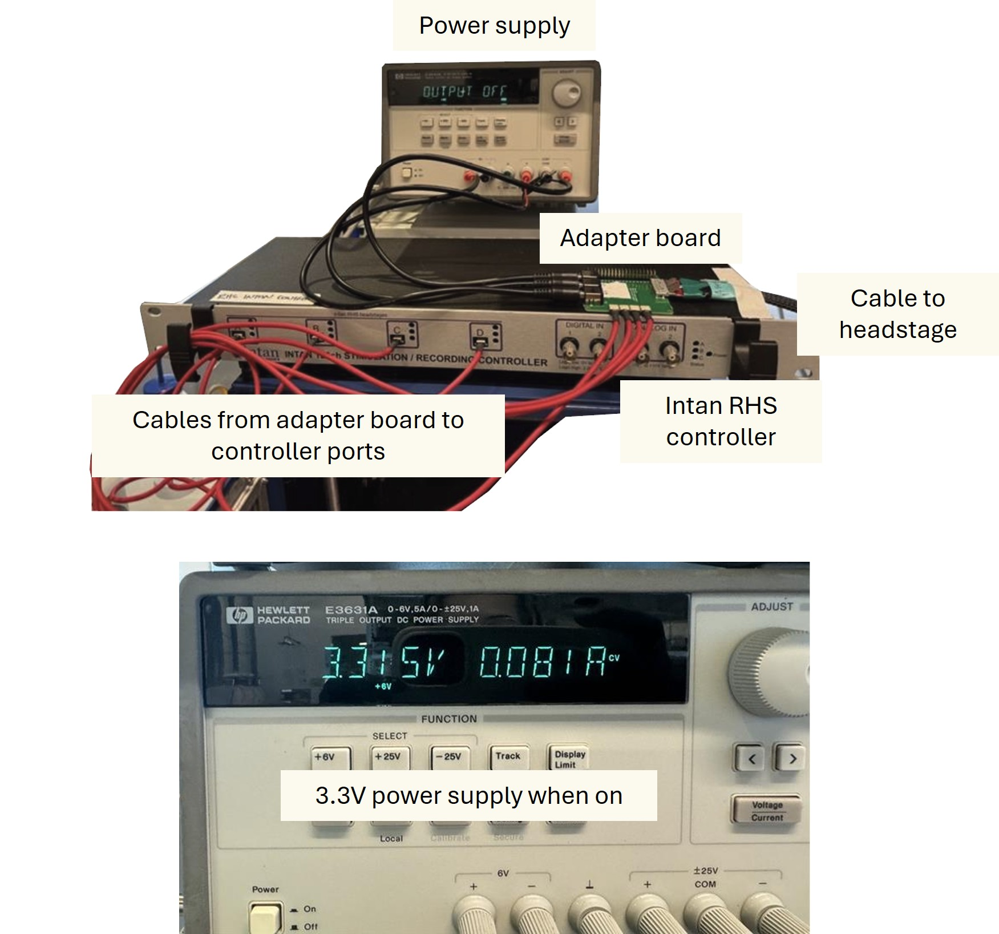
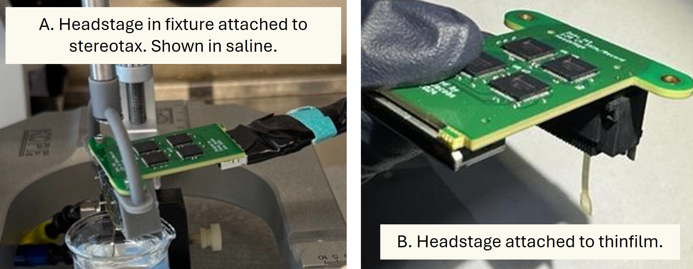

# Iris-128B Quickstart Guide

!!! info Paper
    Open-Source 128-Channel Headstage for Neural Recording and Stimulation
	*(Based on Jacobs et al., 2025 – “Iris 128x: Open-Source 128-Channel Headstages for Neural Stimulation and Recording”)*

---

## 1. System Overview

The Iris-128B system provides 128-channel, fully bidirectional recording and stimulation capability using eight Intan RHS2116 integrated amplifier/stimulator chips.  
It interfaces with thin-film microelectrode arrays through a Samtec SEAF8-20-1-S-08-2-RA connector and communicates with an Intan RHS Controller via low-voltage differential signaling (LVDS) through a Molex 80-pin nanopitch cable and an adapter board.

---

## 2. Power Supply Requirements

Use a bench DC power supply such as the HP E3631A Triple Output DC Power Supply (HP Inc., Palo Alto, CA).  

| Rail | Voltage | Current Limit | Description |
|------|----------|----------------|--------------|
| **Vstim +** | +7 V | 100 mA | Positive stimulation rail |
| **Vstim –** | –7 V | 100 mA | Negative stimulation rail |
| **VCC** | +3.3 V | 100 mA | Digital logic & analog power |

> **Tip:** Keep each supply current-limited to 100 mA to protect the headstage.

*Fig. 1. Wiring diagram containing power supplies, intan controller, adapter board, and cable to headstage.*

---

## 3. Hardware Components

* **Headstage (Iris-128B)** 
    * 8 × Intan RHS2116 ICs (recording + stimulation)
    * Samtec SEAF8 connector (160-pin) for thin-film MEA
    * Molex 80-pin nanopitch output to adapter
    * ±3.3 – 7 V supply range  

* **Adapter Board**
    * Passive signal routing (no active components)  
    * 4 × Omnetics A79633 connectors to Intan RHS ports A–D  
    * 3 × barrel jacks for ±Vstim and VCC  

---

## 4. Hardware Setup

### Step 1 — Prepare for Surgery

1. Secure the animal in a stereotaxic frame.  
2. Mount the 3D-printed headstage holder onto the stereotax.  
3. Seat the thin-film electrode connector into the holder.  
4. Plug the Iris-128B headstage into the thin-film connector.  
5. Fasten the headstage to the holder via mounting holes.

*Fig. 2. (A) Headstage with thinfilm attached to stereotax in 3d printed fixture. (B) Headstage and thinfilm.*

---

### Step 2 — Connect to Adapter

1. Connect the Molex 80-pin cable between headstage and adapter.
2. Route this cable outside the Faraday cage.
3. Plug in the 4 RHS interface cables (red Omnetics):
    *  **S1 → Port A** (shared CLK and CS)  
    *  **S2 → Port B**  
    *  **S3 → Port C**  
    *  **S4 → Port D**

---

### Step 3 — Ground and Reference

- Connect REF and GND pads using platinum wires soldered into the through-holes on the headstage.  
- Keep REF and GND unshorted during normal operation.  
- Optionally, these may be tied together or implemented on the thin-film array.  
- Ensure the entire setup (animal, cage, supplies) shares a common ground.

---

## 5. Software Setup

1. Install Intan RHS Recording Controller Software (see [Intan User Guide](https://intantech.com)).  
2. Connect the RHS Controller to the computer via USB.    

---

## 6. Power-Up Sequence

1. Confirm the Intan controller and power supplies are connected to the chassis ground on the controller (green plug on back of controller) and the grounds on the power supply are all connected to each other as well. 
2. Set voltages on the HP E3631A:
    * +7 V, –7 V, +3.3 V rails  
    * 100 mA current limits  
3. Plug barrel jacks into Vstim± and VCC inputs on the adapter.  
4. Turn on the power supply. 
5. Turn on the Intan Controller.
6. Launch the software — channels from Ports A–D should automatically appear.  
7. Adjust sampling rate and channel naming as needed.

*Fig. 3. Software launch with 4 connected ports (total 128 channels).*

---

## 7. Bench & Animal Setup Checklist

| Stage | Procedure |
|-------|------------|
| **Bench Validation** | Connect planar 128-ch polyimide MEA → verify impedance in PBS (~295 kΩ @ 1 kHz). |
| **Grounding** | Attach platinum wires for REF and GND to headstage pads. |
| **Recording** | Launch Intan software → set sampling rate 30 kSa/s → confirm signal. |
| **In Vivo Setup** | Craniotomy → insert MEA into cortex → connect headstage. |
| **Validation** | Observe LFPs (0.5–100 Hz) and single-unit spikes (~250–500 µVpp). |

---

## 8. Performance Summary

| Metric | Iris 128B | Comparison (Intan 32 ch) |
|---------|------------|--------------------------|
| Noise (Vrms) | 3.09 µV | 2.4 µV |
| Weight | 9.6 g | 1.4 g |
| Volume | 1188 mm³ | 576 mm³ |
| Channels | 128 stim / 128 record | 32 stim / 32 record |
| Frequency Response | 0.5 Hz – 5 kHz (flat midband gain) | Similar |
| Impedance (1 kHz, Pt site) | ~2.9 × 10⁵ Ω | 2.4 × 10⁵ Ω |
| Supply | ±7 V & 3.3 V | 3.3 V (single) |

---

## 9. Stimulation Parameters

- **Chip:** Intan RHS2116 (D5716)  
- **Current Range:** 2.55 µA – 255 µA  
- **Step Size:** 10 nA – 10 µA  
- **Supply Range:** ±3.3 – 10.7 V (max combined 14 V)  
- **Sampling Rates:** 1 – 30 kS/s  
- **Test Waveform:** Biphasic cathodic-first 4 µA, 500 µs pulses, 100 Hz (0.1 mC/cm² charge density)

---

## 10. Additional Notes

* The Molex #205058-1002 cable assembly is discontinued; contact **fdeku@uoregon.edu** or **manuel@openic.org** for updated options.
* The design files, schematics, and BOMs are open-source on GitHub (OpenIC / U Oregon).  
* The Iris 128B and 128S share identical PCB stack-up and fabrication parameters:
    * 8-layer (3 mil trace / space, ENIG finish, 1 oz Cu).  
* Designed in *KiCad*, verified by micro-CT imaging and in vivo electrophysiology recordings.  
* For portable or wireless operation, future iterations aim to reduce weight < 5 g and integrate on-board power management.

---

## 11. Reference Setup Recipe

1. Power on HP E3631A (±7 V & 3.3 V outputs).  
2. Connect thin-film → headstage → adapter → Intan Controller.  
3. Verify REF/GND connections (platinum wire → bone screws).  
4. Enable power and confirm communication in Intan software.  
5. Begin recording and stimulation tests.
