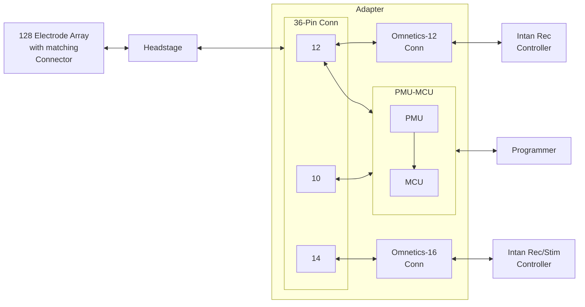
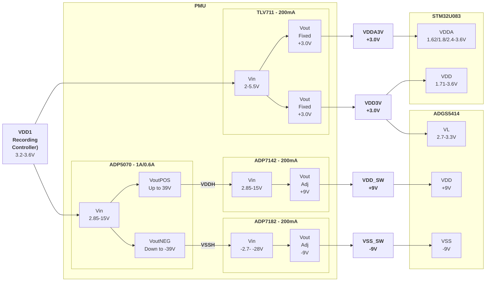
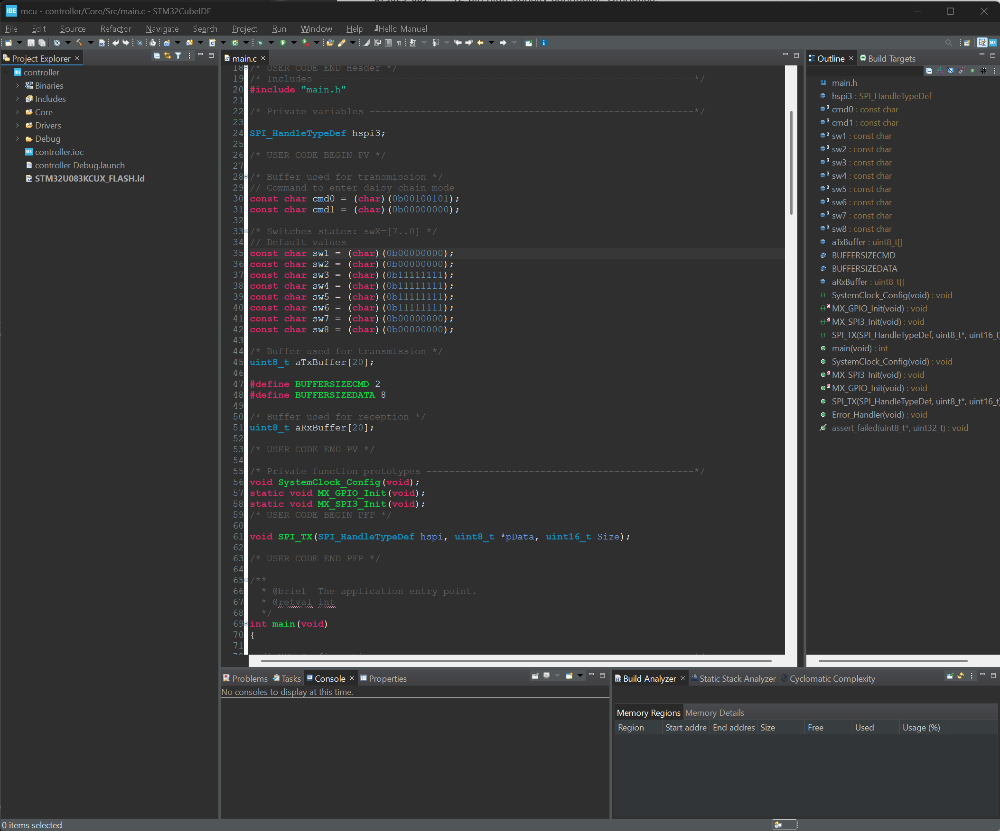

# Adapter

The adapter consists of a 36-pin Omnetics connector, a 12-pin Omnetics connector, a 16-pin Omnetics connector, a power management unit (PMU) block, a microcontroller unit (MCU), and a programmer connector. This system is shown in the figure below.




<br>

<p style="text-align:center"><i><b>Figure 1.</b> System architecutre of the Adapter.</i></p>

The figure below shows the different components of the adapter.


<p style="text-align:center"><i><b>Figure 2.</b> Rendering of the Adapter top and bottom sides indicating its main components.</i></p>

<br>

The table below shows the main components of the Iris-128S adapter. Note the component correspondance with the previous figure.

| Component | Description |
| :-------: | :---------- |
| `RHD +3.3V`   | 64-ch neural recording amplifier chip, Intan. |
| `RHS +3.3V`   | 16-ch neural recording/stimulation chip, Intan. |
| `J1-1` | `RHD +3.3V` pin header. |
| `J7-1` | `VDD3V` pin header. This +3 V supply is generated by the `PMU`. |
| `J2-1` | `VDD_SW` pin header. This +9 V supply is generated by the `PMU`. |
| `J3-1` | `VSS_SW` pin header. This -9 V supply is generated by the `PMU`. |
| `J1-2`, `J7-2` <br> `J2-2`, `J3-2` | `GND` pin headers. |
| `A79623-001`  | 12-pin high-density connector, Omnetics. |
| `A79633-001`  | 16-pin high-density connector, Omnetics. |
| `A79024-001` | 36-pin high-density connector, Omnetics. |
| `J4` | SWD 10-pin 0.05' pitch `Programming Port`. |
| `J6` | `Reset Button` connected to the MCU. |
| `J5` | `Expansion Port` with MCU GPIOs. |
| `STM32U0` | `STM32U083KCU6` Ultra-low-power Arm M0+, 32-bit MCU. |
| `PMU` | Power management unit which generaters +3 V and &plusmn;9 V. |
| `X1` | `ECX-1210B` 32.768 kHz Crystal. |

<br>

---

## Power Management Unit - PMU

The PMU scheme is to provide the analog switches and MCU with their required voltages without altering the performance of the supply going to the Intan chips. We are placing regulators between any device's voltage supply and the power signal coming from the Intan Recording Controller. Switching noise coming from switching regulators could couple-back into the power input source through the regulators and potentially modify Intan chips performance. To minimize this effect, we are choosing switching regulators with a high switching frequency of > 1 MHz. The 64-Ch Intan Recording chip has two 32-input ADCs which digitize the analog inputs at 30 kSa/s per channel. The signal at the input of these ADCs is then sampled at 32 $\times$ 30 kSa/s = 960 kHz. Assuming Nyquist, the frequency content of the ADC input is then 480 kHz. The ADP5070 has a switching frequency of 1.2/2.4 MHz which is outside of this signal bandwidth. We will use the switching frequency of 2.4 MHz.

### Power Source Inputs

| Input (Connector) | S1 (Omnetics-12) | S4 (Omnetics-16) | Pin Headers |
| :---------------: | :--------------: | :--------------: | :---------: |
|     `VDD` Pin     |        T6        |        T8        | `J1`-`J7`   |
|     `GND` Pin     |        B6        |        B8        | `J1`-`J7`   |
|      Source       |  Rec Controller  |  Stim Controller | Unknown     |
|   Input Voltage   |    +3.2 - 3.6 V  |   +3.2 - 3.6 V   | +3.3 V      |

<br>

### Ground Scheme

We have a total of 3 different grounds in the system. These are `GND1` from the Recording controller, `GND2` from the Stimulation controller, and `GND3` from the Pin Headers. We use a commong ground plane for both `GND1` and `GND2`, and two connection points between `GND1` and `GND3` planes using `Net_Ties` close to connectors `S4` and `S5`.

#### Ground Domains

| GND Domain     |      Components         |
| :------------: | :---------------------: |
| `GND1` = `GND2`| 2x RHD2164 & 1x RHS2116 |
|   `GND3`       | PMU + MCU + Switches    |

<br>

### Power Requirements

#### Power Requirement Estimation per Block

|                 Component                 |                 Current                 | # Devices | Total  |
| :---------------------------------------: | :-------------------------------------: | :-------: | :----: |
|   `STM32U083` - Core @ 3.0V (Run Mode)    |                54 uA/MHz                |     1     | 52 uA  |
| `STM32U083` - I/O - Static/Leakage @ 3.0V |           10uA + #I/Os*0.1 uA           |  20 I/Os  | 12 uA  |
|    `STM32U083` - I/O - Dynamic @ 3.0V     | Negligable,<br>not switching expected |    N/A    |  0 uA  |
|     `STM32U083` - Peripherals @ 3.0V      |               ~ 35 uA/MHz               |     1     | 35 uA  |
|         `STM32U083` - Programming         |                 ~10 mA                  |     1     | 10 mA  |
|              `ADGS5414` - IDD             |                < 500 uA                 |     8     |  4 mA  |
|              `ADGS5414` - ISS             |                  1 uA                   |     8     |  8 uA  |
|           `ADGS5414` - IL (1 MHz)         |                  30 uA                  |     8     | 240 uA |

<br>

#### Output Current Requirement Estimation per Regulator

|   Regulator    | Supply | Voltage | Iout (Max) | Components | Required Output Current (Max)  |
| :------------: | :----: | :-----: | :--------: | :--------: | :----------------------------: |
| `ADP7142`        | `VDD_SW` |+9 V | 200 mA | `ADGS5414` - VDD | 4 mA |
| `ADP7182`        | `VSS_SW` |-9 V | 200 mA | `ADGS5414` - VSS | 8 uA |
| `TLV711` - Vout1 | `VDD3V`  |  +3 V   | 200 mA | `ADGS5414` - VL<br>`STM32U083` - VDD<br>`STM32U083` - Programming | 240 uA<br>100 uA<br>~10 mA |
| `TLV711` - Vout2 | `VDDA3V` |  +3 V   | 200 mA | `STM32U083` - VDDA | 50 uA |

<br>

### Block Diagram



<br>

---

## Microcontroller Unit - MCU STM32U083

### Pin Assignment

| Pin Number |    Pin Name    |  Assigned Function    |            Connection             |
| :--------: | :------------: | :-------------------: | :-------------------------------: |
|     1      |      VDD       |        Power          |     VDD3V                         |
|     24     |  PA14 (SWCLK)  |        Prog.          |     J4-4 (PROG-SWD)               |
|   16, 32   |      GND       |        Power          |     GND                           |
|     23     |  PA13 (SWDIO)  |        Prog.          |     J4-2 (PROG-SWD)               |
|     4      |    PF2-NRST    |     Reset/Prog.       |     J4-10 (PROG-SWD), J6 (Button) |
|     5      |   VDDA/VREF+   |        Power          |     VDDA3V                        |
|     17     |     VDD2       |        Power          |     VDD3V                         |
|     2      | PC14-OSC32_IN  |        OSC32          |     Ext. Crystal                  |
|     3      | PC15-OSC32_OUT |        OSC32          |     Ext. Crystal                  |
|     6      |   PA0-CK_IN    |        GPIO           |     J5-1 (Pin-Header)             |
|     7      |      PA1       |        GPIO           |     J5-2 (Pin-Header)             |
|     8      |      PA2       |        GPIO           |     J5-3 (Pin-Header)             |
|     9      |      PA3       |        GPIO           |     J5-4 (Pin-Header)             |
|     10     |      PA4       |     GPIO (DAC1_OUT1)  |     J5-5 (Pin-Header)             |
|     11     |      PA5       |       GPIO            |     J5-6 (Pin-Header)             |
|     12     |      PA6       |       GPIO            |     J5-7 (Pin-Header)             |
|     13     |      PA7       |       GPIO            |     J5-8 (Pin-Header)             |
|     14     |      PB0       |  GPIO (LPUART2_CTS)   |     J5-15 (Pin-Header)            |
|     15     |      PB1       | GPIO (LPUART2_RTS_DE) |     J5-16 (Pin-Header)            |
|     18     |      PA8       |       GPIO            |     LED D3                        |
|     19     |      PA9       |    GPIO (I2C1_SCL)    |     J5-11, 4.7 k&Omega; pull-up  |
|     20     |      PA10      |    GPIO (I2C1_SDA)    |     J5-12, 4.7 k$\Omega$ pull-up  |
|     21     |      PA11      |       GPIO            |     J5-13 (Pin-Header)            |
|     22     |      PA12      |       GPIO            |     J5-14 (Pin-Header)            |
|     25     |      PA15      |       SPI3_NSS        |     CSb_SW                        |
|     26     |      PB3       |       SPI3_SCK        |     SCLK_SW                       |
|     27     |      PB4       |       SPI3_MISO       |     MISO_SW                       |
|     28     |      PB5       |       SPI3_MOSI       |     MOSI_SW                       |
|     29     |      PB6       |   GPIO (LPUART2_TX)   |     J5-17 (Pin-Header)            |
|     30     |      PB7       |   GPIO (LPUART2_RX)   |     J5-18 (Pin-Header)            |
|     31     |   PF3-BOOT0    |        BOOT0          |     GND (via 0$\Omega$)           |
|     33     |  Exposed Pad   |     Exposed Pad       |               GND                 |

<br>

### Pin Connections

#### Power: Pins VDD (1, 17), VDDA (5), & GND (16, 32)

* V~DD~: External power supply for I/Os (V~DDIO1~), the internal regulator and the system analog.
* V~DDA~: External power supply for embedded analog components. It is independent from V~DD~.
* No power up/down sequence required.

**Bypass Capacitors:**
* VDD - VSS
  * 1x 4.7 uF ceramic cap.
  * 1x 100 nF ceramic cap per VDD pin.
* VDDA - VSS
  * 1x 1 uF ceramic cap.
  * 1x 100 nF ceramic cap.
  * 1x 10 nF ceramic cap.


#### SWD: Pins SWDIO (23), SWCLK (24)

* Connected to `J4` connector without any pull-up or pull-down resistors.

#### BOOT0: Pin BOOT0 (31)

* 1x 0$\Omega$ resistor to GND.

#### Reset: Pin NRST (4)

* This pin is internally connected to a permanent pull-up resistor, R~PU~.
* Connected to `J4` connector for programming and pulse-button switch to reset the device locally..
* Filter capacitor of 0.1 uF to ground placed as close as possible to the device.

#### LF External Oscillator (2, PC14-OSC32_IN; 3, PC15-OSC32_OUT)

The `X1` crystal used in the board is the *ECX-1210B* by *ECS*, with a C~L~ = 6 pF.

<br>

#### J4 - Programming Connector

| Pin Number | Description      | Pin Number | Description      |
| :--------: | :--------------: | :--------: | :--------------: |
| 1          | T_VCC (VDD3V)    | 2          | T_SWDIO (PA13)   |
| 3          | GND              | 4          | T_SWCLK (PA14)   |
| 5          | GND              | 6          | T_SWO (NC)       |
| 7          | T_JRCLK/NC (NC)  | 8          | T_JTDI/NC (NC)   |
| 9          | GNDDetect (GND)  | 10         | T_NRST (NRST)    |

<br>

#### J5 - GPIO Connector


| Pin Number | Description       | Pin Number | Description      |
| :--------: | :---------------: | :--------: | :--------------: |
| 1          | PA0               | 2          | PA1              |
| 3          | PA2               | 4          | PA3              |
| 5          | PA4 (SPI1_NSS)    | 6          | PA5 (SPI1_SCK)   |
| 7          | PA6 (SPI1_MISO)   | 8          | PA7 (SPI1_MOSI)  |
| 9          | GND               | 10         | VDD3V            |
| 11         | PA9 (I2C1_SCL)    | 12         | PA10 (I2C1_SDA)  |
| 13         | PA11              | 14         | PA12             |
| 15         | PB0               | 16         | PB1              |
| 17         | PB6 (LPUART2_TX)  | 18         | PB7 (LPUART2_RX) |
| 19         | GND               | 20         | VDD3V            |

<br>

## 3. Programming the Adapter MCU

### MCU Peripherals used in the Project

1. `RCC`: System clock configuration.
2. `GPIO`: Configuring MCU I/Os.
3. `SPI3`: SPI block.

<br>

#### GPIOs

| Pin Name | Signal on Pin  | GPIO Output Level | GPIO Mode        | GPIO Pull-up/Pull-down |
| -------- | -------------- | ----------------- | ---------------- | ---------------------- |
| PA8      | N/A            | Low               | Output Push Pull | No pull-up/pull-down   |
| PA15     | N/A (SPI3_NSS) | Low               | Output Push Pull | No pull-up/pull-down   |
| PB3      | SPI3_SCK       | N/A               | Alternate Function Push Pull | No pull-up/pull-down   |
| PB4      | SPI3_MISO      | N/A               | Alternate Function Push Pull | No pull-up/pull-down   |
| PB5      | SPI3_MOSI      | N/A               | Alternate Function Push Pull | No pull-up/pull-down   |

<br>

#### SPI Block in MCU

| Parameter    | Value              |
| ------------ | ------------------ |
| Mode         | Full-Duplex Master |
| Frame Format | Motorola           |
| Data Size    | 8 bits             |
| First Bit    | MSB first          |
| Baud Rate    | 62.5 kb/s          |
| CPOL         | Low                |
| CPHA         | 1 Edge             |

<br>

### Building & Flashing

The `adapter` board has a `STM32U083` ultra-low-power Arm M0+ 32-bit microcontroller (MCU) which is used to program the state of the switches in the headstage through `SPI` communication. You can use any tool you want to build the firmware and program the MCU; here we use the `STM32Cube` tools. The figure below shows a screenshot of the `STM32CubeIDE` with the `main.c` file in the center panel. You can download all the project documents from our [github repository](https://github.com/openic-org/iris-128). To build the project, click on the :hammer: button.


<p style="text-align:center"><i><b>Figure 7.</b> Screenshoot of the <b>STM32CubeIDE</b> with the <b>main.c</b> file in the center panel.</i></p>

<br>

To program the MCU, we use the `STM32CubeProgrammer`. Connect the `STLINK-V3` to the computer and the `adapter` board using the 10-pin ribbon cable. Press the `Connect` button to connect and identify the board. Program or `flash` the MCU by clicking on `Program`.


<p style="text-align:center"><i><b>Figure 8.</b> Screenshoot of the <b>STM32CubeProgrammer</b>.</i></p>

<br>

### Changing the State of the Switches

You can change the state of each of the switches in the eight octal `ADGS5414` by updating the values of the constants shown below. Notice that the bit `swX[Y]` corresponds to the `Y` switch of component `uX`, where `X`,`Y` $\in \{1,2,...8 \}$ . The value of `0` indicates the switch is open whereas the `1` indicates it is closed.

| Function    | Actions |
| :---------: | :------------------- |
| Recording   | `OPEN` the switch to the RHS2116 and `CLOSE` the one to the RHD2164. |
| Stimulation | `CLOSE` the switch to the RHS2116 and `OPEN` the one to the RHD2164. |


#### Example Code

```c
/* Switches states: swX=[7..0] */
// Default values
const char sw1 = (char)(0b00000000);
const char sw2 = (char)(0b00000000);
const char sw3 = (char)(0b11111111);
const char sw4 = (char)(0b11111111);
const char sw5 = (char)(0b11111111);
const char sw6 = (char)(0b11111111);
const char sw7 = (char)(0b00000000);
const char sw8 = (char)(0b00000000);
```

!!! Warning
	When configuring a stimulation channel, make sure to `OPEN` the switch connected to the `RHD2164`. Failure to do so can cause damage to the `RHD2164` due to the possibility of higher than expected voltages at its input.

<br>

### FW variables values for recording through RHD2164 chips

| Variable |   Value    |
| :------: | :--------: |
|   sw1    | 0b00000000 |
|   sw2    | 0b00000000 |
|   sw3    | 0b11111111 |
|   sw4    | 0b11111111 |
|   sw5    | 0b11111111 |
|   sw6    | 0b11111111 |
|   sw7    | 0b00000000 |
|   sw8    | 0b00000000 |

<br>

### FW variables values for Stim through RS0

| Variable |   Value    |
| :------: | :--------: |
|   sw1    | 0b00000000 |
|   sw2    | 0b00000000 |
|   sw3    | 0b11111111 |
|   sw4    | 0b11111111 |
|   sw5    | 0b10111111 |
|   sw6    | 0b11111111 |
|   sw7    | 0b00000000 |
|   sw8    | 0b00000010 |

<br>

### Further Development

The current use of the MCU is to program the state of the switches in the headstage after the `adapter` board is powered on. You could further expand the functions of the MCU to adapt the `Iris-128s` neural interface to your project. For this purpose, the `adapter` board features a `reset button`, a `32 kHz crystal`, and a `expansion port` with flexible `GPIO` for easy prototyping and development.


