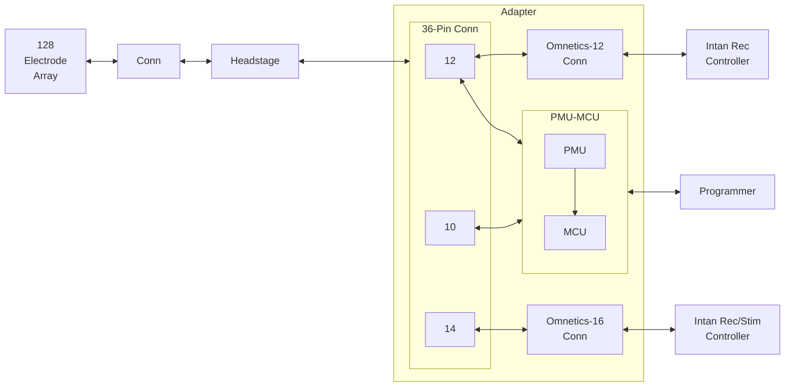

# Adapter

The adapter consists of a 36-pin Omnetics connector, a 12-pin Omnetics connecotr, a 16-pin Omnetics connector, a power management unit (PMU) block, a microcontroller unit (MCU), and a programmer connector. This system is shown in the figure below.

 

<i><b>Figure 1.</b> System architecutre of the Adapter.</i>

The figure below shows the different components of the adapter.

<i><b>Figure 2.</b> Rendering of the Adapter top and bottom sides indicating its main components.</i>

 

The table below shows the main components of the Iris-128S adapter. Note the component correspondance with the previous figure.

| Component | Description |
| :-------: | :---------- |
| `RHD +3.3V`   | 64-ch neural recording amplifier chip, Intan. |
| `RHS +3.3V`   | 16-ch neural recording/stimulation chip, Intan. |
| `J1-1` | `RHD +3.3V` pin header. |
| `J7-1` | `VDD3V` pin header. This +3 V supply is generated by the `PMU`. |
| `J2-1` | `VDD_SW` pin header. This +9 V supply is generated by the `PMU`. |
| `J3-1` | `VSS_SW` pin header. This -9 V supply is generated by the `PMU`. |
| `J1-2`, `J7-2`   `J2-2`, `J3-2` | `GND` pin headers. |
| `A79623-001`  | 12-pin high-density connector, Omnetics. |
| `A79633-001`  | 16-pin high-density connector, Omnetics. |
| `A79024-001` | 36-pin high-density connector, Omnetics. |
| `J4` | SWD 10-pin 0.05' pitch `Programming Port`. |
| `J6` | `Reset Button` connected to the MCU. |
| `J5` | `Expansion Port` with MCU GPIOs. |
| `STM32U0` | `STM32U083KCU6` Ultra-low-power Arm M0+, 32-bit MCU. |
| `PMU` | Power management unit which generaters +3 V and &plusmn;9 V. |
| `X1` | `ECX-1210B` 32.768 kHz Crystal. |

 

---

## PMU

 

---

## STM32U083 Microcontroller

### SPI Block in MCU

| Parameter    | Value              |
| ------------ | ------------------ |
| Mode         | Full-Duplex Master |
| Frame Format | Motorola           |
| Data Size    | 8 bits             |
| First Bit    | MSB first          |
| Baud Rate    | 62.5 kb/s          |
| CPOL         | Low                |
| CPHA         | 1 Edge             |

### FW variables values for recording through R64 chips

| Variable |   Value    |
| :------: | :--------: |
|   sw1    | 0b00000000 |
|   sw2    | 0b00000000 |
|   sw3    | 0b11111111 |
|   sw4    | 0b11111111 |
|   sw5    | 0b11111111 |
|   sw6    | 0b11111111 |
|   sw7    | 0b00000000 |
|   sw8    | 0b00000000 |

### FW variables values for Stim through RS0 - ELEC9

| Variable |   Value    |
| :------: | :--------: |
|   sw1    | 0b00000000 |
|   sw2    | 0b00000000 |
|   sw3    | 0b11111111 |
|   sw4    | 0b11111111 |
|   sw5    | 0b10111111 |
|   sw6    | 0b11111111 |
|   sw7    | 0b00000000 |
|   sw8    | 0b00000010 |