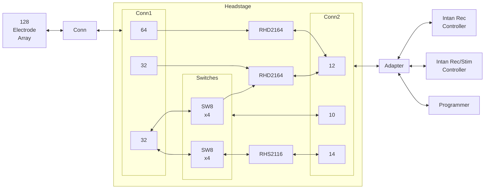
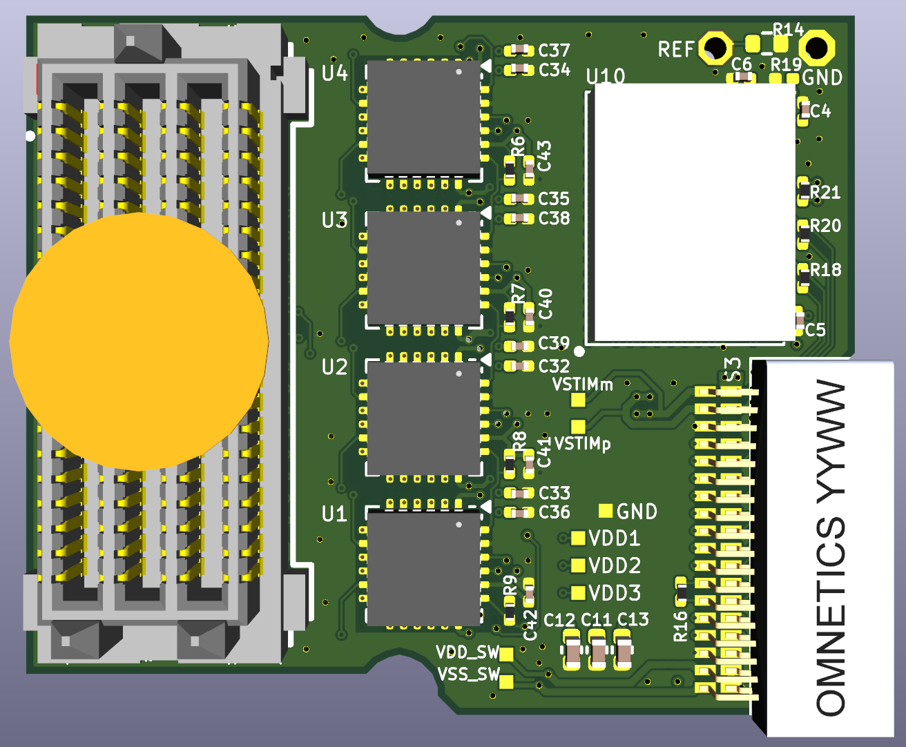
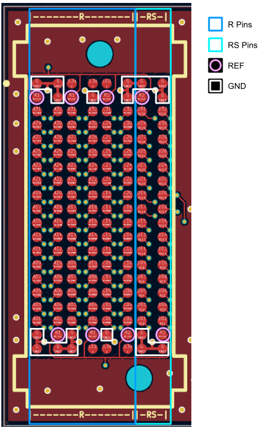
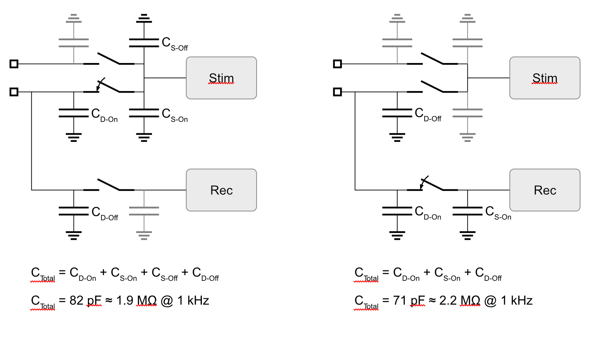
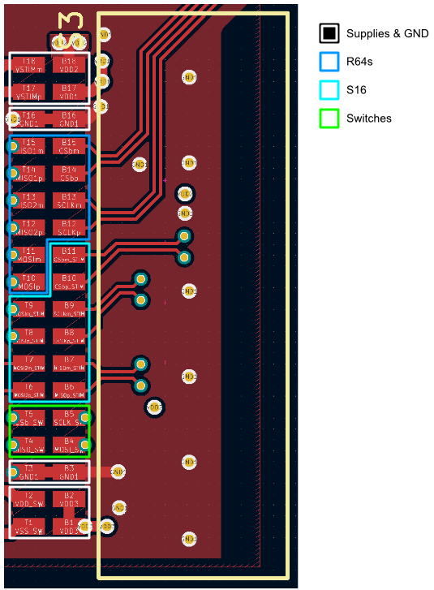
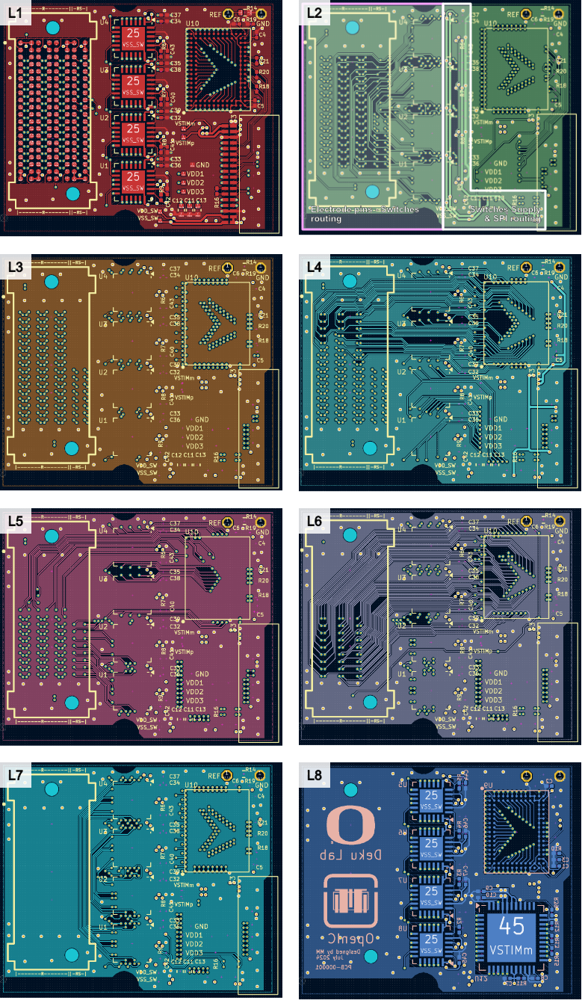
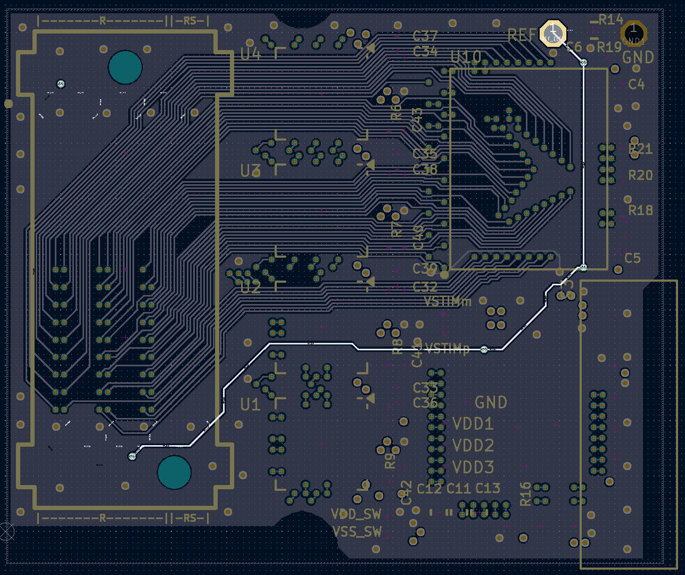

# Headstage

The headstage consists of the input 128-pin connector (*Conn1*), the analog switches (*Switches*), the recording (*RHD2164*) and stimulation (*RHS2116*) chips, and the output 36-pin connector (*Conn2*). This system is shown in the figure below, where the numbers inside the *Conn1* and *Conn2* blocks represent a set of pins from the connector.

<i><b>Figure 1.</b> System architecutre of the Headstage.</i>

 

<i><b>Figure 2.</b> Schematic of the Headstage.</i>

 

We describe each component below:

|  Component  |         Part          | Manufacturer | Description       |
| :---------: | :-------------------: | :----------: | :---------------- |
|   `Conn1`   | SEAM8-20-S02.0-S-08-3 |    Samtec    | 160-pin connector |
|   `Conn2`   |      A79024-001       |   Omnetics   | 36-pin connector  |
|    `SW8`    |     ADGS5414BCPZ      |     ADI      | Analog switches   |
|  `RHD2164`  |        RHD2164        |    Intan     | Recording chip    |
|  `RHS2116`  |        RHS2116        |    Intan     | Stimulation chip  |

 

The PCB of the *headstage* has a size of 30.2 x 25.5 mm^2^. 

<i><b>Figure 3.</b> Rendering of the Headstage PCB (left) top and (right) bottom sides.</i>

 

## Electrode Array Connector

We are currently using the *SEAM8 Samtec* connector for interfacing with 128-ch electrode array. The top and bottom two rows are dedicated for `GND`, `3.3V`, `LED`, and `REF` connectors. The remaining 16x8 of them are for connecting to the 128 electrodes. The first 6 columns to the left are *recording only* `R` pins while the first 2 columns to the right are *recording and simulation* `RS` pins. These pins are shown in the figure below.

<i><b>Figure 4.</b> Details of the electrode array connector footprint.</i>

 

We describe each pin type below:

| Pin Type | # Pins | Description |
| :------: | :----: | :---------- |
| `R`      | 96     | Recording only pins where 64 of them are connected to all inputs of 1x `R64` chip and the rest to 32 inputs of a second `R64` chip. |
| `RS`     | 32     | Recording and stimulation pins connected to all 64x inputs of 8x `ADGS5414` octal analog switches such that each `RS` pin is connected to 2x analog switches inputs. |
| `REF`    | 8      | These pins are all shorted together and are connected to the reference electrode. |
| `GND`    | 18     | These pins are all shorted and connected to the *headstage* ground. |
| `3.3V`   | 4      | Unconnected. |
| `LED`    | 2      | Unconnected. |

 

## Analog Switches

The analog switches connect the 32x `RS` pins to 32x inputs of one `RHD2164` chip and all 16x inputs of the `RHS2116` chip using 8x `ADGS5414` chips. This connection is shown in the figure below.

<i><b>Figure 5.</b> Analog switches configuration.</i>

 

The switches are placed at the input of the `RHS2116` chip. This Intan chip uses stimulation supplies of +/-7 V, which means that the voltage compliance at the inputs of the chip should be +/-7 V. This fact rules out the majority of standard analog switches/muxes since their input/output voltage range is usually limited to +/-2.5 V or +5 V. In addition, the input/output capacitances of the switches add parasitic capacitances which could affect the performance of the neural amplifiers. The figure below shows the added capacitance at the input of each amplifier caused by the analog switches. Thus, we selected the `ADGS5414` octal analog switch because it has low parasitic switch capacitances and withstand an input voltage range higher than +/-7 V. These switches are powered with supplies higher or equal to +/-9 V.

<i><b>Figure 6.</b> Input switches capacitances.</i>

 

One nice feature of the `ADGS5414` is its capability to *daisy-chain* many of them, creating a long shift-register using their SPI blocks.

<i><b>Figure 7.</b> Daisy-chain configuration of `ADGS5414` octal analog switches.</i>

 

The `GND` for the analog switches is shared with the `RHD2164` and `RHS2116` chips.

## RHD2164 & RHS2116

The `RHD2164` and `RHS2116` *Intan* chips are used here without any modification from their usual configuration. Both `RHD2164` have a shared supply `VDD1` coming from the recording controller, and are set up with `LVDS` outputs. The `RHS2116` chip has independent supplies of `VDD2`, `VSTIMp`, and `VSTIMm` coming from the stimulation controller, and is set up with `LVDS` outputs. All 3x chips share the same `REF` electrode and the same `GND`. The `GND` is also shared with the analog switches.

## Interface Connector

We are using the 36-pin A79024-001 *Omnetics* connector to bring all the signals from the headstage to the controller PCB. Using a single connector helps with simplifying the design. We assign the pins in the connector based on the three main parts of the headstage: recording, stimulation, and switches. This can be seen in the table and figure below.

|  Pin Number  | Description |  Pin Number  | Description |
| :----------: | :---------: | :----------: | :---------: |
|    `T18`     |   VSTIMm    |    `B18`     |    VDD2     |
|    `T17`     |   VSTIMp    |    `B17`     |    VDD1     |
|    `T16`     |     GND     |    `B16`     |     GND     |
|    `T15`     |   MISO1m    |    `B15`     |    CSbm     |
|    `T14`     |   MISO1p    |    `B14`     |    CSbp     |
|    `T13`     |   MISO2m    |    `B13`     |    SCLKm    |
|    `T12`     |   MISO2p    |    `B12`     |    SCLKp    |
|    `T11`     |    MOSIm    |    `B11`     |  CSbm_STIM  |
|    `T10`     |    MOSIp    |    `B10`     |  CSbp_STIM  |
|     `T9`     | MOSIm_STIM  |     `B9`     | SCLKm_STIM  |
|     `T8`     | MOSIp_STIM  |     `B8`     | SCLKp_STIM  |
|     `T7`     |   Unused    |     `B7`     | MISOm_STIM  |
|     `T6`     |   Unused    |     `B6`     | MISOp_STIM  |
|     `T5`     |   CSb_SW    |     `B5`     |   SCLK_SW   |
|     `T4`     |   MISO_SW   |     `B4`     |   MOSI_SW   |
|     `T3`     |     GND     |     `B3`     |     GND     |
|     `T2`     |   VDD_SW    |     `B2`     |    VDD3     |
|     `T1`     |   VSS_SW    |     `B1`     |    VDD3     |

 

<i><b>Figure 8.</b> Details of the Interface Connector footprint.</i>

 

## PCB

We use an 8 layer stack where we prioritize shielding of the traces connecting the electrode array with the analog switches and recording chip `RHD2164`. The table below shows a summary of our strategy. The top L1 and bottom L2 layers are used for minimal local routing around the components and `GND` plane. Layer L2 is used for supply and SPI routing of the analog switches. Adding a `GND` plane allows us to also use this layer for sensitive routing between the electrode pins and the analog switches (see figure below). Layer L3 is used as a `GND` plane to shield any signal routing from the switches supplies and SPI routing. Layers L4, L5, and L6 are used for analog routing between the electrode pins, switches, recording `RHD2164`, and stimulation `RHS2116` chips. Layer L4 is also used to route the `RHD2164` supplies from the interface connector. This routing is localized to the far right side of the board and shielded with `GND` planes in layers L3, L4, and L5. Layer L7 is used for some additional local routing between the switches and to bring the SPI signals to the interface connector. The SPI routing is shielded with a `GND` plane in layers L6, L7, and, where possible, in layer L8.

The PCB for the *headstage* has a size of 30.2 x 25.5 mm^2^. The table below shows the PCB specifications and the figures below show a rendering of the PCB top and bottom sides.

#### PCB Specifications

|       PCB Specification       |       Value        |
| :---------------------------: | :----------------: |
|             Size              | 30.2 x 25.5 mm^2^ |
|       Trace Width/Space       |   3 mil / 3 mil    |
|            Layers             |         8          |
| Thru-Hole Via (Hole/Diameter) |   8 mil / 14 mil   |
|   Microvia  (Hole/Diameter)   |   6 mil / 12 mil   |
|           Thickness           |  0.039 in (1 mm)   |
|        Surface Finish         |        ENIG        |
|         Copper Weight         |        1 oz        |

 

#### PCB Stack Up

| Layer  | Notes                                                        |
| :----: | ------------------------------------------------------------ |
|   1    | Minimal local routing + GND plane                            |
|        | Prepreg                                                      |
|   2    | Supplies + SPI + some electrode signal routing + `GND` plane |
|        | Core                                                         |
|   3    | GND plane                                                    |
|        | Prepreg                                                      |
|   4    | Signal routing + some supply traces + `GND` plane            |
|        | Core                                                         |
|   5    | Signal routing + `GND` plane                                 |
|        | Prepreg                                                      |
|   6    | Signal routing + `GND` plane                                 |
|        | Core                                                         |
|   7    | `GND` plane + SPI routing                                    |
|        | Prepreg                                                      |
|   8    | Minimal local routing + `GND` plane                          |

 

<i><b>Figure 9.</b> PCB layout with detailed routing for each layer.</i>

 

The reference electrode `REF` is routed in layer L6 with its trace shielded with `GND` planes in layers L5, L6, and L7. This is shown in the figure below.

<i><b>Figure 10.</b> Reference electrode routing.</i>

 

### PCB Stack

The target PCB stack is shown below, with a total thickness of 1 mm.

#### Headstage PCB Vias

| Layer | Via1 | &mu;Via1 | &mu;Via2 | &mu;Via3 | &mu;Via4 | &mu;Via5 | &mu;Via6 | &mu;Via7 |
| :---: | :--: | :------: | :------: | :------: | :------: | :------: | :------: | :------: |
| 1 | ----- | :octicons-dash-24::octicons-dash-24::octicons-dash-24: |  |  |  |  |  |  |
|   | \|    | \|                 | | | | | | |
| 2 | \|    | :octicons-dash-24: | --- | | | | | |
|   | \|    |                    | \|                 | | | | | |
| 3 | \|    |                    | --- | :octicons-dash-24: | | | | |
|   | \|    |               |               |  $\textbar$   |               |               |               |               |
| 4 | \|    |               |               | $\textemdash$ | $\textemdash$ |               |               |               |
|   | \|    |               |               |               |  $\textbar$   |               |               |               |
| 5 | \|    |               |               |               | $\textemdash$ | $\textemdash$ |               |               |
|   | \|    |               |               |               |               |  $\textbar$   |               |               |
| 6 | \|    |               |               |               |               | $\textemdash$ | $\textemdash$ |               |
|   | \|    |               |               |               |               |               |  $\textbar$   |               |
| 7 | \|    |               |               |               |               |               | $\textemdash$ | $\textemdash$ |
|   | \|    |               |               |               |               |               |               |  $\textbar$   |
| 8 | ----- |              |               |               |               |               |               | $\textemdash$ |
