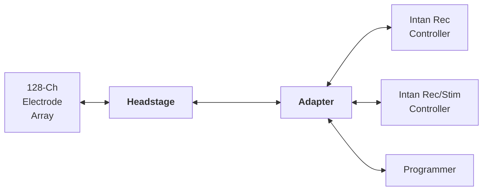

# Iris-128S

<i><b>Figure 1.</b> Iris-128S Neural Interface.</i>

## Description

The Iris-128S neural interface consists of 2 boards: the *headstage* and the *adapter*. The *headstage* is a small electronic board that is normally placed on top of or nearby the animal model being studied. It has been designed to be as small as possible while using standard, commercially available off-the-shelf components. The *adapter* is a small electronic board which has been designed to interface with the Intan Recording Controller, the Intan Rec/Stim Controller, and a programmer/computer to program the switches in the *headstage* via a MCU.

The architecture and schematic of Iris-128S are shown in the figures below.

<i><b>Figure 2.</b> System Architecture of Iris-128S.</i>

 

<i><b>Figure 3.</b> Schematic of Iris-128S.</i>

 

Here are the descriptions of each component.

|       Component       |            Page                            |
| :-------------------: | :----------------------------------------: |
|       Headstage       | [Headstage](headstage_iris128s.md)         |
|       Adapter         | [Adapter](adapter_iris128s.md)             |
|   Quickstart Guide    | [Quickstart Guide](quickstart_iris128s.md) |

## Specifications

* Recording from all 128 channels.
* Stimulation from 32 designated channels, where up to 16 of them can be selected for simultaneous stimulation.
* Compatible with Intan Recording Controller and Intan Stim/Record Controller.
* *SEAM8 Samtec* connector for interfacing with 128-ch electrode array and compatible with *BlackRock Cereplex E headstages*.
* The *headstage* has a size of 30.2 x 25.5 mm^2^.
* *Omnetics 36-POS* connector to interface with *Adapter* board through a single cable.
* *Adapter* board draws power directly from the Intan Recording Controller to power itself and the *headstage*.
* On-board power management unit (PMU) in the *Adapter* board generates the required supplies for the MCU and *ADGS5414* switches.
* Programmer in the *Adapter* board is only needed to update the firmware in the MCU, i.e., change the state of the *ADGS5414* switches. After MCU is programmed, only the Intan controlleres are needed.
* The *adapter* has a size of 50 x 40 mm^2^.

