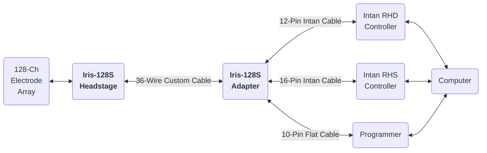
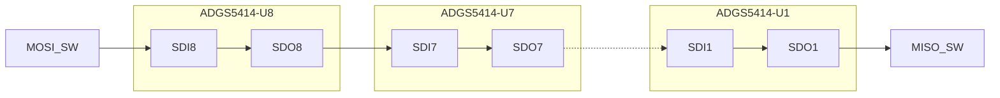

# Iris-128S Quickstart Guide

!!! info Paper
    Open-Source 128-Channel Headstage for Neural Recording and Stimulation
	*(Based on Jacobs et al., 2025 – “Iris 128x: Open-Source 128-Channel Headstages for Neural Stimulation and Recording”)*

---

## 1. System Overview

The `Iris-128S` neural interface consists of a `headstage` and an `adapter`, and provides with 128-channel, selective bidirectional recording and stimulation capability using two `RHD2164` and one `RHS2116` Intan integrated amplifier and amplifier/stimulation chips. It interfaces with *thin-film microelectrode arrays* through a Samtec `SEAF8` connector and communicates with an Intan RHD Controller and a RHS Controller via low-voltage differential signaling (LVDS) through Intan Omnetics cables. The `headstage` and `adapter` are connected with a `36-wire custom cable`. A microcontroller (MCU) in the `adapter` can be programmed with a MCU-compatible programmer.

The architecture of `Iris-128S` neural interface is shown in the figure below.

<i><b>Figure 1.</b> System Architecture of Iris-128S.</i>

---

## 2. Hardware Components

List of required components:

* Iris-128S Headstage
* Iris-128S Adapter
* 36-Wire Custom Cable
* 160-pin Samtec SEAF8 connector
* Electrode Array
* Intan RHD Controller
* Intan RHS Controller
* 12-Pin Intan Cable
* 16-Pin Intan Cable
* 10-Pin Flat Cable
* STLINK-V3 Programmer
* Computer

### 2.1. Iris-128S Headstage

The figure below shows the different components of the headstage.

<i><b>Figure 2.</b> Photos of the Headstage (top) top and (bottom) bottom sides indicating its main components.</i>

 

The table below shows the main components of the Iris-128S headstage. Note the component correspondance with the previous figure.

<i><b>Table 2.</b> Main components of the Iris-128S Headstage.</i>

| Component | Description | Value |
| :-------- | :---------- | :---- |
| STLINK-V3 | MCU programmer.     | |
| Computer  | With ST development tools, Git | |
| 36-Wire Cable | Plug this cable to the Headstage and Controller. | |
| Intan Rec Controller Cable with Adapter Board | Plug this cable to the 12-pin Omnetics connector. | |
| Intan Stim Controller Cable with Adapter Board | Plug this cable to the 16-pin Omnetics connector. | |
| Programming cable | Plug this cable to the 10-pin 0.5' connector. | |
| VDD1 | Powers R64 chips in headstage and PMU in controller. | +3.3 V |
| VDD2 | Powers S16 chip in headstage. | +3.3 V |
| VSTIMp | Powers S16 chip in headstage. | +7 V |
| VSTIMm | Powers S16 chip in headstage. | -7 V |
| GNDs | Controller GND with Supplies GND. | 0 V |

 

---

### 2.4. Electrode Mapping

==Insert Diagram==

### R64 (U10) Switches

| R64 Input | RS Pin | Switch | Variable in FW |
| :-------: | :----: | :----: | :------------: |
|    IN1    |  RS15  |  U6-1  |     sw6[0]     |
|    IN3    |  RS12  |  U6-2  |     sw6[1]     |
|    IN5    |  RS14  |  U6-3  |     sw6[2]     |
|    IN7    |  RS13  |  U6-4  |     sw6[3]     |
|    IN9    |  RS16  |  U3-8  |     sw3[7]     |
|   IN11    |  RS17  |  U3-7  |     sw3[6]     |
|   IN13    |  RS19  |  U3-6  |     sw3[5]     |
|   IN14    |  RS21  |  U3-4  |     sw3[3]     |
|   IN15    |  RS18  |  U3-5  |     sw3[4]     |
|   IN19    |  RS22  |  U3-2  |     sw3[1]     |
|   IN21    |  RS23  |  U3-1  |     sw3[0]     |
|   IN23    |  RS11  |  U6-5  |     sw6[4]     |
|   IN25    |  RS10  |  U6-6  |     sw6[5]     |
|   IN27    |  RS8   |  U6-7  |     sw6[6]     |
|   IN29    |  RS9   |  U6-8  |     sw6[7]     |
|   IN30    |  RS20  |  U3-3  |     sw3[2]     |
|   IN31    |  RS6   |  U5-1  |     sw5[0]     |
|   IN32    |  RS24  |  U4-8  |     sw4[7]     |
|   IN33    |  RS25  |  U4-7  |     sw4[6]     |
|   IN34    |  RS7   |  U5-2  |     sw5[1]     |
|   IN35    |  RS27  |  U4-6  |     sw4[5]     |
|   IN36    |  RS5   |  U5-3  |     sw5[2]     |
|   IN38    |  RS4   |  U5-4  |     sw5[3]     |
|   IN40    |  RS26  |  U4-5  |     sw4[4]     |
|   IN48    |  RS29  |  U4-4  |     sw4[3]     |
|   IN50    |  RS28  |  U4-3  |     sw4[2]     |
|   IN52    |  RS30  |  U4-2  |     sw4[1]     |
|   IN54    |  RS31  |  U4-1  |     sw4[0]     |
|   IN56    |  RS3   |  U5-5  |     sw5[4]     |
|   IN58    |  RS2   |  U5-6  |     sw5[5]     |
|   IN60    |  RS0   |  U5-7  |     sw5[6]     |
|   IN62    |  RS1   |  U5-8  |     sw5[7]     |

### S16 Switches

| S16 Input | RS Pin | Switch | Variable in FW |
| :-------: | :----: | :----: | :------------: |
|   ELEC0   |  RS10  |  U7-3  |     sw7[2]     |
|   ELEC0   |  RS11  |  U7-4  |     sw7[3]     |
|   ELEC1   |  RS21  |  U2-5  |     sw2[4]     |
|   ELEC1   |  RS20  |  U2-6  |     sw2[5]     |
|   ELEC2   |  RS27  |  U1-3  |     sw1[2]     |
|   ELEC2   |  RS26  |  U1-4  |     sw1[3]     |
|   ELEC3   |  RS9   |  U7-1  |     sw7[0]     |
|   ELEC3   |  RS8   |  U7-2  |     sw7[1]     |
|   ELEC4   |  RS7   |  U8-7  |     sw8[6]     |
|   ELEC4   |  RS6   |  U8-8  |     sw8[7]     |
|   ELEC5   |  RS22  |  U2-7  |     sw2[6]     |
|   ELEC5   |  RS23  |  U2-8  |     sw2[7]     |
|   ELEC6   |  RS24  |  U1-1  |     sw1[0]     |
|   ELEC6   |  RS25  |  U1-2  |     sw1[1]     |
|   ELEC7   |  RS29  |  U1-5  |     sw1[4]     |
|   ELEC7   |  RS28  |  U1-6  |     sw1[5]     |
|   ELEC8   |  RS2   |  U8-3  |     sw8[2]     |
|   ELEC8   |  RS3   |  U8-4  |     sw8[3]     |
|   ELEC9   |  RS1   |  U8-1  |     sw8[0]     |
|   ELEC9   |  RS0   |  U8-2  |     sw8[1]     |
|  ELEC10   |  RS30  |  U1-7  |     sw1[6]     |
|  ELEC10   |  RS31  |  U1-8  |     sw1[7]     |
|  ELEC11   |  RS4   |  U8-5  |     sw8[4]     |
|  ELEC11   |  RS5   |  U8-6  |     sw8[5]     |
|  ELEC12   |  RS13  |  U7-5  |     sw7[4]     |
|  ELEC12   |  RS14  |  U7-6  |     sw7[5]     |
|  ELEC13   |  RS19  |  U2-3  |     sw2[2]     |
|  ELEC13   |  RS18  |  U2-4  |     sw2[3]     |
|  ELEC14   |  RS12  |  U7-7  |     sw7[6]     |
|  ELEC14   |  RS15  |  U7-8  |     sw7[7]     |
|  ELEC15   |  RS16  |  U2-1  |     sw2[0]     |
|  ELEC15   |  RS17  |  U2-2  |     sw2[1]     |

---

### 2.3. 36-Wire Custom Cable

---

### 2.4. Adapter

---

## 3. Programming the Adapter MCU

---

## 4. Hardware Setup

---

## 5. Software Setup

---

## 6. Power-Up Sequence

---

## 7. Bench & Animal Setup Checklist

---

## 8. Performance Summary

---

## 9. Stimulation Parameters

---

## 10. Additional Notes

---

## 11. Reference Setup Recipe

| Reference Setup |
| :-------------- |
| 1. Connect all GNDs in the system. |
| 2. Connect electrode array -> headstage -> adapter -> Intan Controllers. |
| 3. Verify REF/GND connections (platinum wire, bone screw, headstage ground, system ground). |
| 4. Power on Intan RHS Controller and RHD Controller and confrim communication with headstage. |
| 5. Update MCU firmware if needed. |
| 6. Begin recording and stimulation tests. |

## Analog Switches

SWX_EN: 0=Open; 1=Closed

### SPI Block in MCU

| Parameter    | Value              |
| ------------ | ------------------ |
| Mode         | Full-Duplex Master |
| Frame Format | Motorola           |
| Data Size    | 8 bits             |
| First Bit    | MSB first          |
| Baud Rate    | 62.5 kb/s          |
| CPOL         | Low                |
| CPHA         | 1 Edge             |

### FW variables values for recording through R64 chips

| Variable |   Value    |
| :------: | :--------: |
|   sw1    | 0b00000000 |
|   sw2    | 0b00000000 |
|   sw3    | 0b11111111 |
|   sw4    | 0b11111111 |
|   sw5    | 0b11111111 |
|   sw6    | 0b11111111 |
|   sw7    | 0b00000000 |
|   sw8    | 0b00000000 |

### FW variables values for Stim through RS0 - ELEC9

| Variable |   Value    |
| :------: | :--------: |
|   sw1    | 0b00000000 |
|   sw2    | 0b00000000 |
|   sw3    | 0b11111111 |
|   sw4    | 0b11111111 |
|   sw5    | 0b10111111 |
|   sw6    | 0b11111111 |
|   sw7    | 0b00000000 |
|   sw8    | 0b00000010 |

