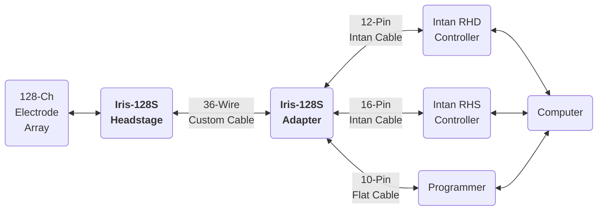
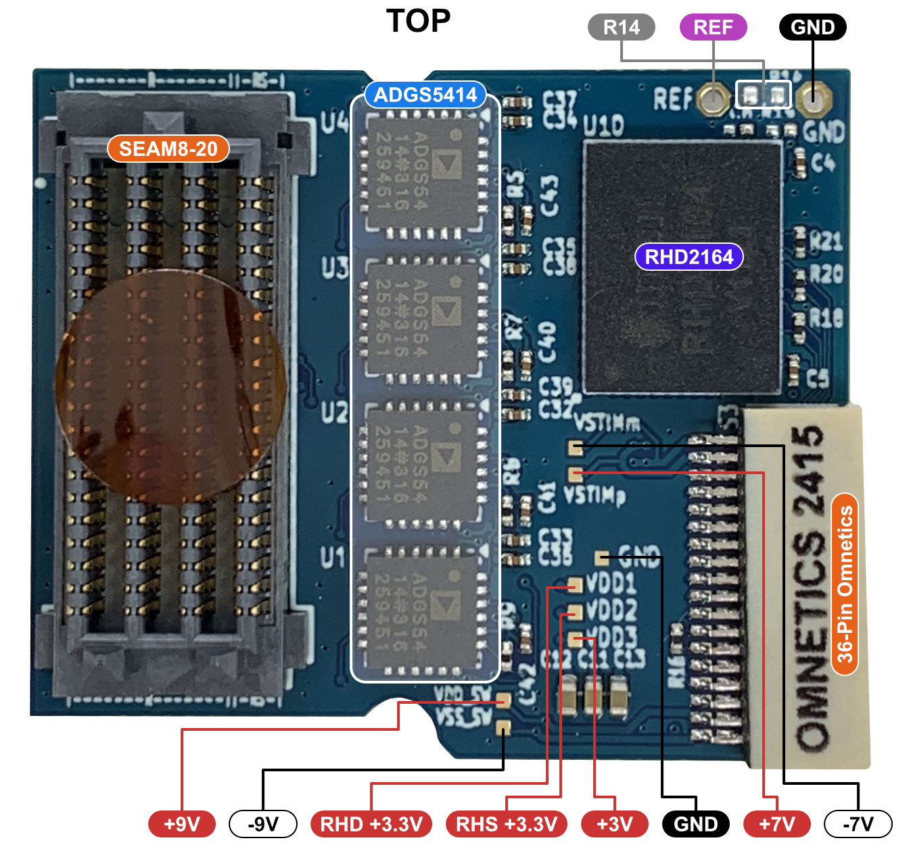
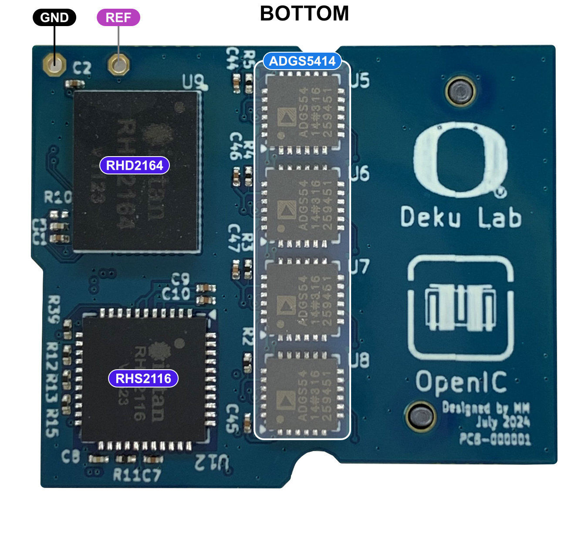
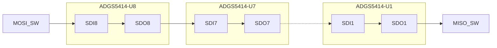

# Iris-128S Quickstart Guide

!!! info Paper
    Open-Source 128-Channel Headstage for Neural Recording and Stimulation
	*(Based on Jacobs et al., 2025 – “Iris 128x: Open-Source 128-Channel Headstages for Neural Stimulation and Recording”)*

---

## 1. System Overview

The `Iris-128S` neural interface consists of a `headstage` and an `adapter`, and provides with 128-channel, selective bidirectional recording and stimulation capability using two `RHD2164` and one `RHS2116` Intan integrated amplifier and amplifier/stimulation chips. It interfaces with *thin-film microelectrode arrays* through a Samtec `SEAF8` connector and communicates with an Intan RHD Controller and a RHS Controller via low-voltage differential signaling (LVDS) through Intan Omnetics cables. The `headstage` and `adapter` are connected with a `36-wire custom cable`. A microcontroller (MCU) in the `adapter` can be programmed with a MCU-compatible programmer.

The architecture of `Iris-128S` neural interface is shown in the figure below.

<i><b>Figure 1.</b> System Architecture of Iris-128S.</i>

---

## 2. Hardware Components

List of required components:

* Iris-128S Headstage
* Iris-128S Adapter
* 36-Wire Custom Cable
* 160-pin Samtec SEAF8 connector
* Electrode Array
* Intan RHD Controller
* Intan RHS Controller
* 12-Pin Intan Cable
* 16-Pin Intan Cable
* 10-Pin Flat Cable
* STLINK-V3 Programmer
* Computer

| | | |
| :--: | :--- | --- |
| STLINK-V3 | MCU programmer.     | |
| Computer  | With ST development tools, Git | |
| 36-Wire Cable | Plug this cable to the Headstage and Controller. | |
| Intan Rec Controller Cable with Adapter Board | Plug this cable to the 12-pin Omnetics connector. | |
| Intan Stim Controller Cable with Adapter Board | Plug this cable to the 16-pin Omnetics connector. | |
| Programming cable | Plug this cable to the 10-pin 0.5' connector. | |

 

### 2.1. Iris-128S Headstage

The figure below shows the different components of the headstage.

<i><b>Figure 2.</b> Photos of the Headstage top and bottom sides indicating its main components.</i>

 

The table below shows the main components of the Iris-128S headstage. Note the component correspondance with the previous figure.

<i><b>Table 2.</b> Main components of the Iris-128S Headstage.</i>

| Component | Description | Value |
| :-------: | :---------- | :---- |
| `RHD2164`   | 64-ch neural recording amplifier chip, Intan. |
| `RHS2116`   | 16-ch neural recording/stimulation chip, Intan. |
| `ADGS5414`  | Octal high-voltage analog switch, Analog Devices. |
| `SEAM8-20`  | 160-pin high-density connector, Samtec. |
| `A79024-001` | 36-pin high-density connector, Omnetics. |
| `R14` | Unpopulated resistor which can be used to connect `REF` and `GND`. |
| `REF` | Reference pin. |
| `GND` | GND pin. |
| `VDD1` | +3.3 V Supply for `RHD2164` chips, testpoint. |
| `VDD2` | +3.3 V Supply for `RHS2116` chip, testpoint. |
| `VDD3` | +3 V Supply to `ADGS5414` chip, testpoint. |
| `VDD_SW` | +9 V Supply for `ADGS5414` chip, testpoint. |
| `VSS_SW` | -9 V Supply for `ADGS5414` chip, testpoint. |
| `VSTIMp` | +7 V Supply for `RHS2116` chip, testpoint. |
| `VSTIMm` | -7 V Supply for `RHS2116` chip, testpoint. |

 

---

### 2.4. Electrode Mapping

==Insert Diagram==

#### Recording Electrodes

| Electrode Array   Connector Pin | Intan Chip Pin | Electrode Array   Connector Pin | Intan Chip Pin |
| :--------------------------------: | :------------: | :--------------------------------: | :------------: |
| R0  | REC0IN1  | R48 | REC0IN4  |
| R1  | REC0IN54 | R49 | REC0IN6  |
| R2  | REC0IN62 | R50 | REC0IN26 |
| R3  | REC0IN60 | R51 | REC0IN31 |
| R4  | REC0IN58 | R52 | REC0IN33 |
| R5  | REC0IN56 | R53 | REC0IN22 |
| R6  | REC0IN3  | R54 | REC0IN13 |
| R7  | REC0IN29 | R55 | REC0IN15 |
| R8  | REC0IN46 | R56 | REC0IN14 |
| R9  | REC0IN48 | R57 | REC0IN18 |
| R10 | REC0IN52 | R58 | REC0IN20 |
| R11 | REC0IN50 | R59 | REC0IN24 |
| R12 | REC0IN5  | R60 | REC1IN46 |
| R13 | REC0IN27 | R61 | REC0IN12 |
| R14 | REC0IN59 | R62 | REC0IN17 |
| R15 | REC0IN63 | R63 | REC1IN17 |
| R16 | REC0IN45 | R64 | REC1IN0  |
| R17 | REC0IN47 | R65 | REC1IN16 |
| R18 | REC0IN7  | R66 | REC1IN63 |
| R19 | REC0IN25 | R67 | REC1IN8  |
| R20 | REC0IN51 | R68 | REC0IN21 |
| R21 | REC0IN55 | R69 | REC1IN2  |
| R22 | REC0IN43 | R70 | REC1IN18 |
| R23 | REC0IN61 | R71 | REC1IN4  |
| R24 | REC0IN9  | R72 | REC1IN61 |
| R25 | REC0IN23 | R73 | REC1IN26 |
| R26 | REC0IN40 | R74 | REC0IN19 |
| R27 | REC0IN35 | R75 | REC1IN20 |
| R28 | REC0IN57 | R76 | REC1IN6  |
| R29 | REC0IN41 | R77 | REC1IN22 |
| R30 | REC0IN11 | R78 | REC1IN45 |
| R31 | REC0IN16 | R79 | REC1IN43 |
| R32 | REC0IN30 | R80 | REC1IN53 |
| R33 | REC0IN32 | R81 | REC1IN37 |
| R34 | REC0IN53 | R82 | REC1IN24 |
| R35 | REC0IN39 | R83 | REC1IN10 |
| R36 | REC0IN0  | R84 | REC1IN47 |
| R37 | REC0IN10 | R85 | REC1IN55 |
| R38 | REC0IN36 | R86 | REC1IN41 |
| R39 | REC0IN38 | R87 | REC1IN42 |
| R40 | REC0IN49 | R88 | REC1IN12 |
| R41 | REC0IN37 | R89 | REC1IN28 |
| R42 | REC0IN2  | R90 | REC1IN59 |
| R43 | REC0IN8  | R91 | REC1IN57 |
| R44 | REC0IN28 | R92 | REC1IN51 |
| R45 | REC0IN34 | R93 | REC1IN49 |
| R46 | REC0IN42 | R94 | REC1IN39 |
| R47 | REC0IN44 | R95 | REC1IN44 |

 

#### Stimulating/Recording Electrodes

| Electrode Array   Connector Pin | Intan Chip Pin | Switch Pin | FW Variable |
| :--------------------------------: | :------------: | :--------: | :---------: |
| RS0  | STIM9  | U8-2 | sw8[1] |
| RS1  | STIM9  | U8-1 | sw8[0] |
| RS2  | STIM8  | U8-3 | sw8[2] |
| RS3  | STIM8  | U8-4 | sw8[3] |
| RS4  | STIM11 | U8-5 | sw8[4] |
| RS5  | STIM11 | U8-6 | sw8[5] |
| RS6  | STIM4  | U8-8 | sw8[7] |
| RS7  | STIM4  | U8-7 | sw8[6] |
| RS8  | STIM3  | U7-2 | sw7[1] |
| RS9  | STIM3  | U7-1 | sw7[0] |
| RS10 | STIM0  | U7-3 | sw7[2] |
| RS11 | STIM0  | U7-4 | sw7[3] |
| RS12 | STIM14 | U7-7 | sw7[6] |
| RS13 | STIM12 | U7-5 | sw7[4] |
| RS14 | STIM12 | U7-6 | sw7[5] |
| RS15 | STIM14 | U7-8 | sw7[7] |
| RS16 | STIM15 | U2-1 | sw2[0] |
| RS17 | STIM15 | U2-2 | sw2[1] |
| RS18 | STIM13 | U2-4 | sw2[3] |
| RS19 | STIM13 | U2-3 | sw2[2] |
| RS20 | STIM1  | U2-6 | sw2[5] |
| RS21 | STIM1  | U2-5 | sw2[4] |
| RS22 | STIM5  | U2-7 | sw2[6] |
| RS23 | STIM5  | U2-8 | sw2[7] |
| RS24 | STIM6  | U1-1 | sw1[0] |
| RS25 | STIM6  | U1-2 | sw1[1] |
| RS26 | STIM2  | U1-4 | sw1[3] |
| RS27 | STIM2  | U1-3 | sw1[2] |
| RS28 | STIM7  | U1-6 | sw1[5] |
| RS29 | STIM7  | U1-5 | sw1[4] |
| RS30 | STIM10 | U1-7 | sw1[6] |
| RS31 | STIM10 | U1-8 | sw1[7] |
| RS0  | REC1IN60 | U5-7 | sw5[6] |
| RS1  | REC1IN62 | U5-8 | sw5[7] |
| RS2  | REC1IN58 | U5-6 | sw5[5] |
| RS3  | REC1IN56 | U5-5 | sw5[4] |
| RS4  | REC1IN38 | U5-4 | sw5[3] |
| RS5  | REC1IN36 | U5-3 | sw5[2] |
| RS6  | REC1IN31 | U5-1 | sw5[0] |
| RS7  | REC1IN34 | U5-2 | sw5[1] |
| RS8  | REC1IN27 | U6-7 | sw6[6] |
| RS9  | REC1IN29 | U6-8 | sw6[7] |
| RS10 | REC1IN25 | U6-6 | sw6[5] |
| RS11 | REC1IN23 | U6-5 | sw6[4] |
| RS12 | REC1IN3  | U6-2 | sw6[1] |
| RS13 | REC1IN7  | U6-4 | sw6[3] |
| RS14 | REC1IN5  | U6-3 | sw6[2] |
| RS15 | REC1IN1  | U6-1 | sw6[0] |
| RS16 | REC1IN9  | U3-8 | sw3[7] |
| RS17 | REC1IN11 | U3-7 | sw3[6] |
| RS18 | REC1IN15 | U3-5 | sw3[4] |
| RS19 | REC1IN13 | U3-6 | sw3[5] |
| RS20 | REC1IN30 | U3-3 | sw3[2] |
| RS21 | REC1IN14 | U3-4 | sw3[3] |
| RS22 | REC1IN19 | U3-2 | sw3[1] |
| RS23 | REC1IN21 | U3-1 | sw3[0] |
| RS24 | REC1IN32 | U4-8 | sw4[7] |
| RS25 | REC1IN33 | U4-7 | sw4[6] |
| RS26 | REC1IN40 | U4-5 | sw4[4] |
| RS27 | REC1IN35 | U4-6 | sw4[5] |
| RS28 | REC1IN50 | U4-3 | sw4[2] |
| RS29 | REC1IN48 | U4-4 | sw4[3] |
| RS30 | REC1IN52 | U4-2 | sw4[1] |
| RS31 | REC1IN54 | U4-1 | sw4[0] |

 

---

### 2.3. 36-Wire Custom Cable

---

### 2.4. Adapter

The figure below shows the different components of the headstage.

<i><b>Figure 2.</b> Rendering of the Adapter top and bottom sides indicating its main components.</i>

The table below shows the main components of the Iris-128S headstage. Note the component correspondance with the previous figure.

<i><b>Table 2.</b> Main components of the Iris-128S Headstage.</i>

| Component | Description | Value |
| :-------: | :---------- | :---- |
| `RHD +3.3V`   | 64-ch neural recording amplifier chip, Intan. |
| `RHS +3.3V`   | 16-ch neural recording/stimulation chip, Intan. |
| `J1-1` | `RHD +3.3V` pin header. |
| `J7-1` | `VDD3V` pin header. This +3 V supply is generated by the `PMU`. |
| `J2-1` | `VDD_SW` pin header. This +9 V supply is generated by the `PMU`. |
| `J3-1` | `VSS_SW` pin header. This -9 V supply is generated by the `PMU`. |
| `J1-2`, `J7-2`   `J2-2`, `J3-2` | `GND` pin headers. |
| `A79623-001`  | 12-pin high-density connector, Omnetics. |
| `A79633-001`  | 16-pin high-density connector, Omnetics. |
| `A79024-001` | 36-pin high-density connector, Omnetics. |
| `J4` | SWD 10-pin 0.05' pitch `Programming Port`. |
| `J6` | `Reset Button` connected to the MCU. |
| `J5` | `Expansion Port` with MCU GPIOs. |
| `STM32U0` | `STM32U083KCU6` Ultra-low-power Arm M0+, 32-bit MCU. |
| `PMU` | Power management unit which generaters +3 V and $\pm$9 V. |
| `X1` | `ECX-1210B` 32.768 kHz Crystal. |

---

## 3. Programming the Adapter MCU

---

## 4. Hardware Setup

---

## 5. Software Setup

---

## 6. Power-Up Sequence

---

## 7. Bench & Animal Setup Checklist

---

## 8. Performance Summary

---

## 9. Stimulation Parameters

---

## 10. Additional Notes

---

## 11. Reference Setup Recipe

| Reference Setup |
| :-------------- |
| 1. Connect all GNDs in the system. |
| 2. Connect electrode array -> headstage -> adapter -> Intan Controllers. |
| 3. Verify REF/GND connections (platinum wire, bone screw, headstage ground, system ground). |
| 4. Power on Intan RHS Controller and RHD Controller and confrim communication with headstage. |
| 5. Update MCU firmware if needed. |
| 6. Begin recording and stimulation tests. |

## Analog Switches

SWX_EN: 0=Open; 1=Closed

### SPI Block in MCU

| Parameter    | Value              |
| ------------ | ------------------ |
| Mode         | Full-Duplex Master |
| Frame Format | Motorola           |
| Data Size    | 8 bits             |
| First Bit    | MSB first          |
| Baud Rate    | 62.5 kb/s          |
| CPOL         | Low                |
| CPHA         | 1 Edge             |

### FW variables values for recording through R64 chips

| Variable |   Value    |
| :------: | :--------: |
|   sw1    | 0b00000000 |
|   sw2    | 0b00000000 |
|   sw3    | 0b11111111 |
|   sw4    | 0b11111111 |
|   sw5    | 0b11111111 |
|   sw6    | 0b11111111 |
|   sw7    | 0b00000000 |
|   sw8    | 0b00000000 |

### FW variables values for Stim through RS0 - ELEC9

| Variable |   Value    |
| :------: | :--------: |
|   sw1    | 0b00000000 |
|   sw2    | 0b00000000 |
|   sw3    | 0b11111111 |
|   sw4    | 0b11111111 |
|   sw5    | 0b10111111 |
|   sw6    | 0b11111111 |
|   sw7    | 0b00000000 |
|   sw8    | 0b00000010 |

