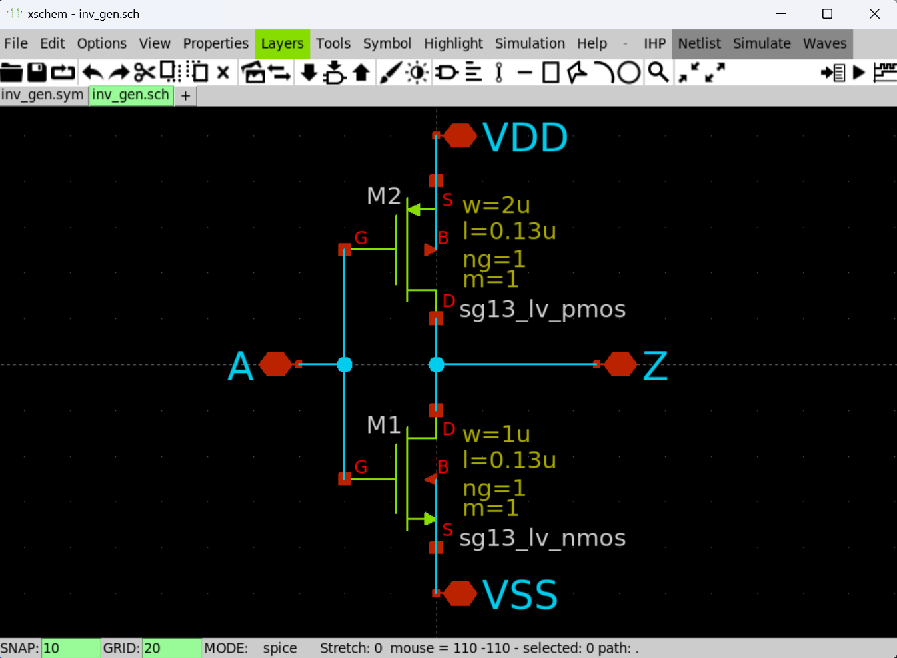

# Parameterized Cells (P-Cells) with Xschem

## Introduction

Xschem allows the use of P-Cells by means of executing a script which is specified as a property of a component in a schematic. Inputs for the script are also declared as properties. To design these scripts, we first build a set of schematic and symbol templates representing each of the building blocks. Then, we use these templates to create specific *scripts which output the blocks’ components as a set of text strings* analogous to the process of reading the schematic view of a component. Thus, Xschem produces a netlist which includes the parametrized cells, ready for simulation with Ngspice.

## Requirements

* WSL-2
* Docker Desktop
* `UNIC-CASS` or `IIC-JKU` Open-Source IC Tools docker container.
* Python
* VS Code

## Example: P-Cell of Inverter

### Schematic & Symbol Templates

1\. Create a new schematic `inv_gen.sch` in your design folder. The schematic should look like the figure below.



2\. Create a new symbol `inv_gen.sym` in your design folder. The symbol should look like the figure below.


!!! note
    It is important that both the `sch` and `sym` files have the same name.

3\. Now, let's take a look at both files in a text editor. We can see that both the schematic and symbol views are text files which can be generated by any script.

=== "inv_gen.sch"

    ``` linenums="1"
    v {xschem version=3.4.6 file_version=1.2}
    G {}
    K {}
    V {}
    S {}
    E {}
    N -40 0 -40 50 {lab=A}
    N -60 0 -40 0 {lab=A}
    N -40 -50 -40 0 {lab=A}
    N 0 0 0 20 {lab=xxx}
    N 0 0 70 0 {lab=xxx}
    N 0 -20 0 0 {lab=xxx}
    N 0 -100 0 -50 {lab=VDD}
    N -0 50 -0 100 {lab=VSS}
    C {sg13g2_pr/sg13_lv_nmos.sym} -20 50 0 0 {name=M1
    l=0.13u
    w=1u
    ng=1
    m=1
    model=sg13_lv_nmos
    spiceprefix=X
    }
    C {sg13g2_pr/sg13_lv_pmos.sym} -20 -50 0 0 {name=M2
    l=0.13u
    w=2u
    ng=1
    m=1
    model=sg13_lv_pmos
    spiceprefix=X
    }
    C {iopin.sym} 0 -100 0 0 {name=p1 lab=VDD}
    C {iopin.sym} 0 100 0 0 {name=p2 lab=VSS}
    C {iopin.sym} -60 0 0 1 {name=p3 lab=A}
    C {iopin.sym} 70 0 0 0 {name=p4 lab=Z}
    ```

=== "inv_gen.sym"

    ``` linenums="1"
    v {xschem version=3.4.6 file_version=1.2}
    G {}
    K {type=subcircuit
    format="@name @pinlist @symname"
    template="name=x1"
    }
    V {}
    S {}
    E {}
    L 4 -20 -20 -20 20 {}
    L 4 -20 -20 20 0 {}
    L 4 -20 20 20 0 {}
    L 4 30 0 50 0 {}
    L 4 -40 0 -20 0 {}
    L 7 0 -20 0 -10 {}
    L 7 0 10 0 20 {}
    B 5 -2.5 -22.5 2.5 -17.5 {name=VDD dir=inout}
    B 5 -42.5 -2.5 -37.5 2.5 {name=A dir=inout}
    B 5 47.5 -2.5 52.5 2.5 {name=Z dir=inout}
    B 5 -2.5 17.5 2.5 22.5 {name=VSS dir=inout}
    A 4 25 0 5 180 360 {}
    T {@symname} 35 4 0 0 0.3 0.3 {}
    T {@name} 35 -32 0 0 0.2 0.2 {}
    T {VDD} 5 -6 2 1 0.2 0.2 {}
    T {A} -35 -14 0 0 0.2 0.2 {}
    T {Z} 45 -14 0 1 0.2 0.2 {}
    T {VSS} 25 6 0 1 0.2 0.2 {}
    ```

### Python Scripts Outputing Schematic Instances

4\. The goal is to create a `Python` script *which output the inverter instances as a set of text strings*. With this in mind, we create the file `inv_gen.py` with the following content:

``` py title="inv_gen.py" linenums="1"
#!/usr/bin/python3

import sys

# ****************************************************************
# Functions
def nmos_sg13_lv_nmos(name,w_um,l_um,ng,m,position):
    libraryname = 'sg13g2_pr'
    modelname = 'sg13_lv_nmos'
    print('C {' + libraryname + '/' + modelname + '.sym} ' + str(position[0]) + ' ' + str(position[1]) + ' ' + str(position[2]) + ' ' + str(position[3]) + ' {name=' + name)
    print('l=' + str(l_um) + 'u')
    print('w=' + str(w_um) + 'u')
    print('ng=' + str(ng))
    print('m=' + str(m))
    print('model=' + modelname)
    print('spiceprefix=X')
    print('}')


def pmos_sg13_lv_pmos(name,w_um,l_um,ng,m,position):
    libraryname = 'sg13g2_pr'
    modelname = 'sg13_lv_pmos'
    print('C {' + libraryname + '/' + modelname + '.sym} ' + str(position[0]) + ' ' + str(position[1]) + ' ' + str(position[2]) + ' ' + str(position[3]) + ' {name=' + name)
    print('l=' + str(l_um) + 'u')
    print('w=' + str(w_um) + 'u')
    print('ng=' + str(ng))
    print('m=' + str(m))
    print('model=' + modelname)
    print('spiceprefix=X')
    print('}')

def iopin(name,label,position):
    pintype = 'iopin'
    print('C {' + pintype + '.sym} ' + str(position[0]) + ' ' + str(position[1]) + ' ' + str(position[2]) + ' ' + str(position[3]) + ' {name=' + name + ' lab=' + label +'}')


# ****************************************************************
# parsing arguments. These are strings.
wn_um = float(sys.argv[1])
wp_um = float(sys.argv[2])

# print schematic
print('v {xschem version=3.4.6 file_version=1.2}')
print('G {}')
print('K {}')
print('V {}')
print('S {}')
print('E {}')
print('N -40 0 -40 50 {lab=A}')
print('N -60 0 -40 0 {lab=A}')
print('N -40 -50 -40 0 {lab=A}')
print('N 0 0 0 20 {lab=xxx}')
print('N 0 0 70 0 {lab=xxx}')
print('N 0 -20 0 0 {lab=xxx}')
print('N 0 -100 0 -50 {lab=VDD}')
print('N -0 50 -0 100 {lab=VSS}')
nmos_sg13_lv_nmos('M1',wn_um,0.13,1,1,[-20,50,0,0])
pmos_sg13_lv_pmos('M2',wp_um,0.13,1,1,[-20,-50,0,0])
iopin('p1','VDD',[0,-100,0,0])
iopin('p2','VSS',[0,100,0,0])
iopin('p3','A',[-60,0,0,1])
iopin('p4','Z',[70,0,0,0])
```

!!! warning "End of Line characters in Linux and Windows"
    Make sure you create the `Python` file from your Linux terminal to make sure of the end-of-line character which could affect the execution of the script.


### Setting Up the P-Cell in Another Schematic

5\. Let's create a testbench to test our P-Cell `inv_gen`. Create a new schematic `tb_inv_ge.sch` to perform a transient simulation. It should look like the figure below.


6\. Select one of the `inv_gen` instances and open its properties by pressing `q`. Edit the properties according to the figure below.

<div class="grid" markdown>


``` title="Instance Properties"
name=x1
wn_um=1
wp_um=2
schematic="inv_gen.py(@wn_um\,@wp_um\)"
tclcommand="edit_file [abs_sym_path inv_gen.py]"
```

</div>

7\. The table below shows each of the properties. Notice how we define the width of each transistor as inputs of the `Python` script, and pass those variables to the script using `@[variable]\`.

| Property   | Description |
| :--------: | :---------- |
| wn_um      | Width of `nmos` in um. |
| wp_um      | Width of `pmos` in um. |
| schematic  | File name of the `Python` script with parsed variables. |
| tclcommand | `TCL` command that executes the script. |


### When is the Script Executed?

8\. The `Python` scripts is executes during:
    * `Netlist` process.
    * `Descending` into the schematic.

<div class="grid" markdown>


</div>

### Simulation with Two Inverter Sizes